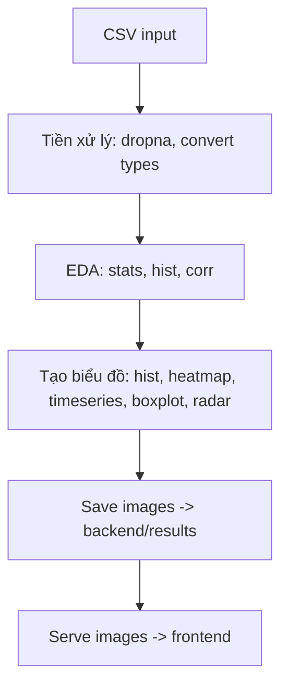

# Sườn báo cáo — Phân tích chất lượng không khí từ dữ liệu khí tượng

Tệp này là một sườn báo cáo chi tiết theo yêu cầu (theo ảnh bạn gửi). Bạn có thể copy từng phần vào bài báo, điều chỉnh số liệu và ảnh thực tế.

## 1. Abstract (Tóm tắt)
- Độ dài: 100–200 từ.
- Nội dung cần có:
  - Bối cảnh ngắn: vấn đề ô nhiễm không khí ngắn gọn.
  - Mục tiêu của báo cáo: phân tích dữ liệu khí tượng để đánh giá các chỉ số ô nhiễm.
  - Phương pháp tóm tắt: EDA, biểu đồ phân bố, ma trận tương quan, phân tích AQI, phát hiện bất thường.
  - Kết quả chính & kết luận tóm lược.

Ví dụ (mẫu):
> Báo cáo này trình bày phân tích chất lượng không khí dựa trên dữ liệu khí tượng thu thập được. Chúng tôi thực hiện khám phá dữ liệu, phân tích phân phối, biểu đồ xu hướng thời gian và ma trận tương quan để xác định các yếu tố ảnh hưởng đến PM2.5 và AQI. Kết quả cho thấy mối tương quan mạnh giữa PM2.5 và [yếu tố X], đồng thời phát hiện một số giá trị bất thường cần kiểm tra thêm. Các biểu đồ và báo cáo tổng hợp lưu ở thư mục `backend/results`.

---

## 2. Introduction (Giới thiệu)
- Độ dài: 1–2 trang.
- Nội dung:
  - Bối cảnh và động cơ nghiên cứu (ô nhiễm không khí, ảnh hưởng sức khỏe, nhu cầu giám sát).
  - Mục tiêu cụ thể của báo cáo (ví dụ: phân tích EDA, đánh giá AQI, phát hiện outlier, tóm tắt cho báo cáo trực quan).
  - Phạm vi và dữ liệu sử dụng (mô tả `sample_data.csv`, các cột quan trọng như PM2.5, PM10, nhiệt độ, độ ẩm,...).
  - Tóm tắt các đóng góp / kết quả mong đợi.

Gợi ý trích file: mô tả file `frontend/sample_data.csv` và cách upload qua UI.

---

## 3. Methods (Phương pháp) — chi tiết kỹ thuật
- Độ dài: 1–3 trang tùy mức chi tiết.
- Các mục con:
  1. Dữ liệu
     - Mô tả các cột, kích thước mẫu, xử lý thiếu (missing values).
     - Vị trí tệp: `frontend/sample_data.csv`.
  2. Tiền xử lý (Preprocessing)
     - Loại bỏ/hoán đổi giá trị thiếu, chuẩn hoá nếu cần (StandardScaler đã imported trong backend).
     - Quy tắc lựa chọn mẫu (ví dụ: lấy tối đa 100 mẫu cho biểu đồ xu hướng).
  3. Khám phá dữ liệu (EDA)
     - Thống kê cơ bản (mean, std, min, max, percentile).
     - Biểu đồ phân phối (histogram), boxplot, heatmap tương quan.
  4. Các phép phân tích bổ sung
     - Phân loại mức AQI (hàm classify_aqi_level)
     - Phát hiện outlier bằng IQR
     - (Nếu dùng): PCA, KMeans (tài liệu đã import trong `backend/app.py` — mô tả ý định nếu dùng)
  5. Cách tạo biểu đồ
     - Đưa link đến route: POST `/api/analyze_csv` (backend) — tải CSV -> backend tạo ảnh và lưu vào `backend/results`.

Mã tham khảo: `backend/app.py` — hàm `analyze_air_pollution_data` và `generate_comprehensive_plots`.

---

## 4. Results (Kết quả) — kèm ảnh và chú thích
- Độ dài: tùy, mỗi biểu đồ 1 đoạn nhỏ (2–6 câu).
- Các biểu đồ đề nghị (theo code hiện tại):
  1. Phân phối các chỉ số ô nhiễm (histograms) — file: `{timestamp}_phan_phoi_chi_so.png`
     - Caption: "Phân phối giá trị cho các chỉ số PM2.5, PM10, ..."
  2. Ma trận tương quan (heatmap) — file: `{timestamp}_ma_tran_tuong_quan.png`
     - Caption: "Ma trận tương quan giữa các chỉ số khí tượng và ô nhiễm"
  3. Xu hướng theo thời gian (time series) — file: `{timestamp}_xu_huong_thoi_gian.png`
     - Caption: "Thay đổi các chỉ số theo mẫu (mẫu đầu tiên/100 mẫu)"
  4. Phân tích giá trị bất thường (boxplot) — file: `{timestamp}_gia_tri_bat_thuong.png`
     - Caption: "Boxplot cho các chỉ số giúp phát hiện outliers"
  5. Phân loại AQI (pie) — file: `{timestamp}_phan_loai_aqi.png`
     - Caption: "Tỷ lệ các mức chất lượng không khí theo AQI"
  6. So sánh các chỉ số (radar chart) — file: `{timestamp}_so_sanh_chi_so.png`
     - Caption: "So sánh các chỉ số (đã chuẩn hóa) cho một số mẫu"

- Cho mỗi ảnh:
  - Thêm 1–2 câu mô tả quan sát chính.
  - Nếu phát hiện bất thường, liệt kê sample id/giá trị (nếu có trong phân tích `outliers`).

Chèn ảnh trong Markdown/Word: ví dụ:
```markdown

*Hình 1: Phân phối các chỉ số ô nhiễm.*
```

---

## 5. Discussion (Bàn luận)
- So sánh kết quả với kỳ vọng/tiền nghiệm.
- Nguyên nhân có thể của các tương quan/đột biến.
- Hạn chế của phân tích (ví dụ: dữ liệu kích thước nhỏ, dữ liệu bị thiếu, đo lường không liên tục).
- Đề xuất xử lý/những nghiên cứu tiếp theo (ví dụ: mô hình dự báo, lấy thêm dữ liệu, kiểm tra nguồn dữ liệu bất thường).

---

## 6. Conclusion (Kết luận)
- Tóm tắt một đoạn 4–6 câu: mục tiêu, phương pháp ngắn, kết quả chính và đề xuất.

---

## 7. Figures & Tables (Danh mục ảnh/bảng)
- Liệt kê các hình kèm caption và đường dẫn file trong `backend/results`.

---

## 8. Appendix (Phụ lục)
- Mã nguồn chính (liệt kê file/đoạn code quan trọng):
  - `backend/app.py` (hàm phân tích & tạo biểu đồ)
  - `frontend/js/app.js` (giao diện upload + tải xuống)
  - `frontend/sample_data.csv`
- Hướng dẫn chạy nhanh (Runbook):
  1. Kích hoạt virtualenv (nếu có)
  2. Cài deps: `pip install -r requirements.txt`
  3. Chạy backend: `python backend/app.py`
  4. Mở `frontend/index.html` trên trình duyệt hoặc serve tĩnh
  5. Upload CSV -> nhấn "Phân tích dữ liệu" -> ảnh xuất trong `backend/results`

---

## 9. Hai sơ đồ (bắt buộc theo yêu cầu ảnh)

1) Sơ đồ 1 — Kiến trúc hệ thống (System Architecture)

```mermaid
graph LR
  subgraph Frontend
    A[Browser - index.html/js] -->|POST /api/analyze_csv| Backend
    A -->|GET /results/filename| Backend
  end
  subgraph Backend
    Backend[Flask app (app.py)] --> Model[Model / Analysis functions]
    Backend --> ResultsFolder[(backend/results)]
    Model -->|call| GeminiModel[model_gemini (optional)]
  end
  ResultsFolder -->|serve images| Frontend
```

- Ghi chú: sơ đồ mô tả luồng upload CSV -> backend phân tích -> lưu ảnh -> frontend hiển thị/tải.

2) Sơ đồ 2 — Luồng xử lý dữ liệu (Data pipeline)



Bạn có thể xuất hai sơ đồ này sang PNG bằng công cụ vẽ (Draw.io / Mermaid live editor) để chèn vào báo cáo.

---

## 10. Checklist nhanh trước nộp báo cáo
- [ ] Các biểu đồ chính đã có trong `backend/results`.
- [ ] Mô tả dữ liệu & nguồn rõ ràng.
- [ ] Mô tả phương pháp & các hàm đã dùng (IQR, classify_aqi_level, ...) có trong báo cáo.
- [ ] Thêm captions & hình trình bày rõ ràng.
- [ ] Kiểm tra chính tả & trích dẫn tài liệu nếu dùng nguồn bên ngoài.

---

## Gợi ý nhỏ về bố cục trang / số chữ
- Tiêu đề + Tên + Ngày
- Abstract (1 đoạn)
- Intro (1 trang)
- Methods (1–2 trang)
- Results (1–2 trang + ảnh kèm chú giải)
- Discussion (nửa trang)
- Conclusion (khoảng 5 câu)
- Appendix (mã, hướng dẫn chạy)

---

Nếu bạn muốn, tôi có thể:
- Tạo file báo cáo mẫu `REPORT_DRAFT.md` với đoạn text mẫu cho từng phần (dễ chỉnh) — bạn muốn tôi tạo luôn không?
- Hoặc xuất các mermaid diagrams thành PNG/SVG và chèn sẵn vào `backend/results` (cần bạn cho phép tôi tạo file ảnh trong repo).

Hoặc tôi có thể chuyển sang tạo một file `REPORT_DRAFT.md` tự động ngay bây giờ (nội dung mô tả + placeholder cho ảnh).