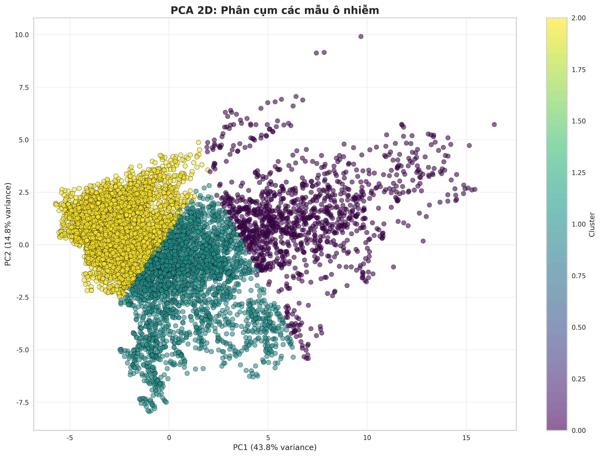
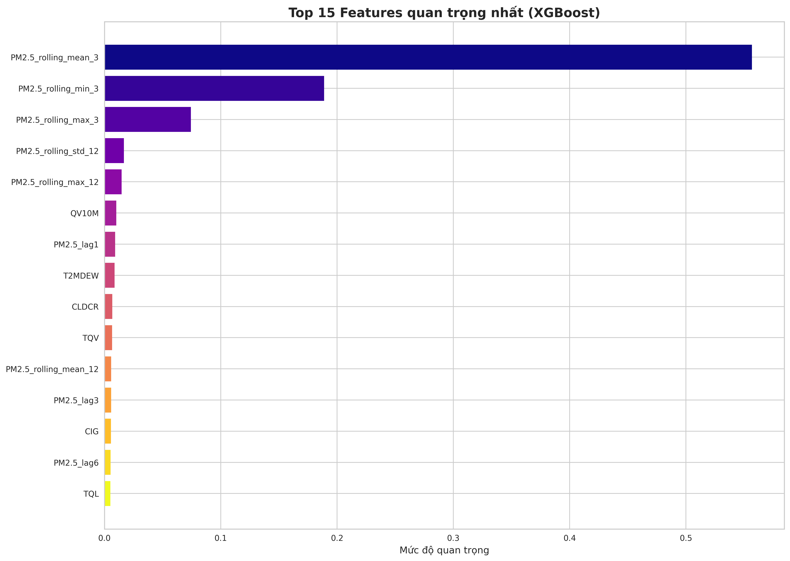

# BÁO CÁO TEST HỆ THỐNG PHÂN TÍCH DỮ LIỆU THỜI TIẾT

**Thời gian tạo báo cáo:** 11/10/2025 11:50:40

## TỔNG QUAN

Báo cáo này trình bày kết quả test hệ thống phân tích dữ liệu thời tiết với 3 dataset khác nhau:

- **Tổng số dataset test:** 3
- **Test thành công:** 3
- **Test thất bại:** 0

## CHI TIẾT KẾT QUẢ TỪNG DATASET

### 1. comb_PM25_Hanoi_2018_sm

**Đường dẫn:** `/home/phamvanhung/system/Desktop/Project_ca_nhan/Web_predict_weather/dataset/comb_PM25_Hanoi_2018_sm.csv`
**Kích thước file:** 1.07 MB
**Trạng thái:** ✅ Thành công

#### Thông tin cơ bản
- **Số mẫu:** 8116
- **Số features:** 11
- **Thời gian phân tích:** 2025-10-11T11:49:36.061377

#### Thống kê mô tả
- **data_quality:** Tốt
- **missing_data_percentage:** 0.0000
- **total_features:** 11.0000
- **total_samples:** 8116.0000

#### Biểu đồ được tạo (14 plots)

**1. Phân phối các chỉ số ô nhiễm**
- File: `20251011_121424_phan_phoi_chi_so.png`

**Đánh giá của Gemini AI:**
Tuyệt vời, hãy cùng phân tích bộ biểu đồ này.

🧩 **1. Mô tả ngắn gọn:**
Ảnh hiển thị phân phối tần suất của 4 chỉ số ô nhiễm không khí: Bụi mịn PM2.5, T2MDEW, T2M và PS. Mỗi biểu đồ là một histogram thể hiện tần suất xuất hiện của các giá trị khác nhau cho từng chỉ số.

📊 **2. Phân tích chuyên sâu:**
- Bụi mịn PM2.5: Phân phối lệch phải rõ rệt, tập trung nhiều ở giá trị thấp và giảm dần về phía giá trị cao. Điều này cho thấy phần lớn thời gian, nồng độ bụi mịn PM2.5 ở mức thấp, nhưng vẫn có những thời điểm nồng độ này tăng cao đáng kể.
- T2MDEW: Phân phối có xu hướng tăng dần, đạt đỉnh ở khoảng giá trị cao nhất. Dữ liệu cho thấy giá trị T2MDEW có xu hướng tập trung ở mức cao.
- T2M: Phân phối gần giống hình chuông (bell-shaped), nhưng lệch trái. Giá trị T2M tập trung nhiều ở khoảng giữa, giảm dần về hai đầu.
- PS: Phân phối hai đỉnh (bimodal), cho thấy có hai nhóm giá trị phổ biến. Điều này có thể phản ánh sự thay đổi theo mùa hoặc theo các yếu tố môi trường khác.

💡 **3. Nhận định & Ý nghĩa:**
- PM2.5: Việc phân phối lệch phải cho thấy cần quan tâm đến các đợt ô nhiễm PM2.5 cao điểm.
- T2MDEW: Giá trị T2MDEW cao có thể liên quan đến độ ẩm và nhiệt độ, cần xem xét mối tương quan với các yếu tố thời tiết khác.
- T2M: Phân phối của T2M cho thấy nhiệt độ có xu hướng tập trung ở một khoảng nhất định.
- PS: Phân phối hai đỉnh của PS cho thấy áp suất có thể thay đổi theo hai trạng thái khác nhau, có thể liên quan đến các hệ thống thời tiết hoặc địa lý.

🚀 **4. Đề xuất:**
- Phân tích tương quan: Nghiên cứu mối tương quan giữa các chỉ số ô nhiễm này để hiểu rõ hơn về mối quan hệ và ảnh hưởng lẫn nhau.
- Phân tích theo thời gian: Xem xét sự thay đổi của các chỉ số này theo thời gian (ví dụ: theo mùa, theo giờ) để xác định các yếu tố gây ra sự biến động.
- Phân tích hồi quy: Xây dựng mô hình hồi quy để dự đoán nồng độ PM2.5 dựa trên các yếu tố khác như T2MDEW, T2M và PS.
- Kiểm tra ngoại lệ: Xác định và phân tích các giá trị ngoại lệ (outliers) để hiểu rõ nguyên nhân và tác động của chúng.

Hy vọng phân tích này hữu ích cho bạn. Hãy cho tôi biết nếu bạn muốn đi sâu hơn vào một khía cạnh cụ thể nào đó.
**Độ tin cậy:** 80.0%

**2. Ma trận tương quan**
- File: `20251011_121424_ma_tran_tuong_quan.png`

**Đánh giá của Gemini AI:**
Tuyệt vời! Với kinh nghiệm của mình, tôi sẽ phân tích ma trận tương quan này một cách chi tiết:

🧩 **1. Mô tả ngắn gọn:**
Biểu đồ là một ma trận tương quan, thể hiện mối tương quan giữa các chỉ số ô nhiễm khác nhau (Bụi mịn PM2.5, T2MDEW, T2M, PS, TQV, TQL, H1000, HLML, RHOA, CIG, WS). Các giá trị trong ma trận cho biết mức độ và hướng của mối tương quan (dương hoặc âm) giữa các cặp biến. Màu sắc thể hiện độ mạnh của tương quan, với màu đỏ đậm biểu thị tương quan dương mạnh, màu xanh đậm biểu thị tương quan âm mạnh, và màu nhạt thể hiện tương quan yếu.

📊 **2. Phân tích chuyên sâu:**
- Tương quan mạnh:
  - T2MDEW, T2M và HLML có tương quan dương rất mạnh với nhau (0.88, 0.94, 0.98). Điều này cho thấy chúng có thể liên quan đến cùng một nguồn hoặc quá trình ô nhiễm.
  - PS và RHOA có tương quan dương mạnh (0.92).
  - PS và H1000 có tương quan dương mạnh (1.0).
  - HLML và RHOA có tương quan âm rất mạnh (-0.99).
- Tương quan yếu:
  - CIG và WS có tương quan yếu với hầu hết các biến khác, cho thấy chúng có thể ít liên quan đến các nguồn ô nhiễm chung.
  - TQL có tương quan yếu với hầu hết các biến khác.
- Tương quan âm:
  - Bụi mịn PM2.5 có tương quan âm vừa phải với T2MDEW, T2M, TQV.
  - PS có tương quan âm với T2MDEW, T2M, TQV.
  - H1000 có tương quan âm với T2MDEW, T2M, TQV.

💡 **3. Nhận định & Ý nghĩa:**
- Có những nhóm biến có tương quan chặt chẽ với nhau, có thể chỉ ra các nguồn hoặc quá trình ô nhiễm chung. Ví dụ, T2MDEW, T2M, HLML có thể bị ảnh hưởng bởi cùng một loại hình hoạt động (giao thông, công nghiệp, hoặc điều kiện thời tiết).
- CIG và WS có vẻ là các chỉ số ô nhiễm độc lập hơn, có thể liên quan đến các hoạt động hoặc nguồn phát thải khác.
- Việc xác định các mối tương quan này có thể giúp các nhà quản lý môi trường tập trung vào các nguồn ô nhiễm quan trọng nhất và phát triển các biện pháp kiểm soát hiệu quả hơn.

🚀 **4. Đề xuất:**
- Phân tích hồi quy: Thực hiện phân tích hồi quy để xác định các yếu tố dự báo chính cho nồng độ bụi mịn PM2.5 và các chỉ số ô nhiễm quan trọng khác.
- Phân tích thành phần chính (PCA): Sử dụng PCA để giảm số lượng biến và xác định các thành phần chính đại diện cho các nguồn ô nhiễm khác nhau.
- Phân tích chuỗi thời gian: Nghiên cứu sự thay đổi của các mối tương quan theo thời gian để hiểu rõ hơn về tác động của các yếu tố mùa vụ hoặc các sự kiện đặc biệt.
- Kiểm chứng bằng dữ liệu khác: So sánh kết quả với dữ liệu từ các nguồn khác (ví dụ: dữ liệu giao thông, dữ liệu công nghiệp) để xác nhận các mối quan hệ và tìm hiểu nguyên nhân gây ô nhiễm.

Hy vọng phân tích này hữu ích! Nếu bạn có bất kỳ câu hỏi nào khác, đừng ngần ngại hỏi.
**Độ tin cậy:** 80.0%

**3. Xu hướng thời gian**
- File: `20251011_121424_xu_huong_thoi_gian.png`

**Đánh giá của Gemini AI:**
Dưới đây là phân tích biểu đồ theo yêu cầu:

🧩 **1. Mô tả ngắn gọn::**
Biểu đồ đường này thể hiện xu hướng thay đổi của năm chỉ số ô nhiễm (Bụi mịn PM2.5, T2MDEW, T2M, PS, TQV) theo thời gian (được đo bằng "mẫu" trên trục hoành).

📊 **2. Phân tích chuyên sâu::**
- PS: Chỉ số PS có giá trị rất cao, ổn định và gần như không đổi trong suốt khoảng thời gian được khảo sát, dao động quanh mức 100,000.
- Các chỉ số khác (Bụi mịn PM2.5, T2MDEW, T2M, TQV): Các chỉ số này có giá trị rất thấp và ít biến động so với PS. Trong đó chỉ có TQV là được thể hiện rõ trên biểu đồ, các chỉ số còn lại gần như trùng với trục hoành.

💡 **3. Nhận định & Ý nghĩa::**
- Sự khác biệt lớn giữa PS và các chỉ số khác: Sự chênh lệch đáng kể về giá trị giữa chỉ số PS và các chỉ số còn lại cho thấy có thể PS là yếu tố ô nhiễm chiếm ưu thế hoặc có đơn vị đo lường khác biệt so với các chỉ số còn lại. Cần xem xét lại đơn vị đo hoặc bản chất của các chỉ số để hiểu rõ hơn.
- Sự ổn định của PS: Giá trị của PS gần như không đổi theo thời gian, điều này cho thấy nguồn phát thải hoặc yếu tố ảnh hưởng đến PS có thể là ổn định và không bị ảnh hưởng bởi các yếu tố thời gian trong khoảng thời gian quan sát.
- Biến động nhỏ của các chỉ số còn lại: Sự biến động nhỏ của các chỉ số còn lại có thể cho thấy chúng ít chịu ảnh hưởng bởi các yếu tố thời gian, hoặc có thể chúng bị "lu mờ" bởi giá trị quá lớn của PS.

🚀 **4. Đề xuất::**
- Kiểm tra lại dữ liệu: Cần kiểm tra lại dữ liệu và đơn vị đo của từng chỉ số, đặc biệt là PS, để đảm bảo tính chính xác và khả năng so sánh giữa các chỉ số.
- Phân tích sâu hơn về PS: Nếu PS là yếu tố ô nhiễm chủ đạo, cần phân tích sâu hơn về nguồn gốc, các yếu tố ảnh hưởng và tác động của nó.
- Chuẩn hóa dữ liệu: Có thể cần chuẩn hóa dữ liệu (ví dụ: sử dụng phương pháp scaling) để đưa các chỉ số về cùng một thang đo, giúp việc so sánh và phân tích trở nên dễ dàng và chính xác hơn.
- Phân tích theo mùa/tháng: Nếu có dữ liệu trong thời gian dài hơn, có thể phân tích xu hướng theo mùa hoặc theo tháng để tìm ra các mô hình biến động theo thời gian.
**Độ tin cậy:** 80.0%

**4. Phân tích giá trị bất thường**
- File: `20251011_121424_gia_tri_bat_thuong.png`

**Đánh giá của Gemini AI:**
Tuyệt vời, tôi sẽ phân tích biểu đồ này theo yêu cầu của bạn.

🧩 **1. Mô tả ngắn gọn:**
Biểu đồ là một boxplot (biểu đồ hộp) hiển thị phân phối giá trị của các chỉ số ô nhiễm khác nhau. Các chỉ số bao gồm: Bụi mịn PM2.5, T2MDEW, T2M, PS, TQV và TQL. Biểu đồ này tập trung vào việc phân tích giá trị bất thường của từng chỉ số.

📊 **2. Phân tích chuyên sâu:**
- Phân bố tập trung: Hầu hết các chỉ số (Bụi mịn PM2.5, T2MDEW, T2M, TQV, TQL) có giá trị tập trung gần 0, với hộp boxplot rất hẹp. Điều này cho thấy sự biến động thấp và giá trị trung bình gần như bằng 0.
- Giá trị ngoại lệ: Các vòng tròn nhỏ bên ngoài hộp boxplot của một vài chỉ số (như Bụi mịn PM2.5) cho thấy sự tồn tại của các giá trị ngoại lệ (outliers). Đây là những giá trị rất khác biệt so với phần lớn dữ liệu.
- Chỉ số PS đột biến: Chỉ số "PS" cho thấy sự khác biệt rõ rệt. Hộp boxplot của PS nằm ở vùng giá trị rất cao, gần 100,000, cho thấy giá trị của chỉ số này cao hơn rất nhiều so với các chỉ số khác.

💡 **3. Nhận định & Ý nghĩa:**
- Sự khác biệt lớn giữa các chỉ số: Các chỉ số ô nhiễm (Bụi mịn PM2.5, T2MDEW, T2M, TQV, TQL) có giá trị tương đối thấp và ổn định. Tuy nhiên, chỉ số "PS" có giá trị rất cao, cho thấy có thể có vấn đề liên quan đến chỉ số này.
- Giá trị ngoại lệ có thể là dấu hiệu: Sự xuất hiện của các giá trị ngoại lệ ở một số chỉ số có thể là dấu hiệu của lỗi đo lường, sự kiện bất thường hoặc các vấn đề khác cần được điều tra thêm.

🚀 **4. Đề xuất:**
- Kiểm tra và xác minh dữ liệu PS: Cần kiểm tra nguồn gốc và độ tin cậy của dữ liệu chỉ số "PS" để đảm bảo không có lỗi trong quá trình thu thập hoặc xử lý.
- Phân tích sâu hơn về giá trị ngoại lệ: Điều tra nguyên nhân của các giá trị ngoại lệ trong các chỉ số như Bụi mịn PM2.5. Có thể cần thu thập thêm thông tin liên quan đến thời điểm và địa điểm xuất hiện các giá trị này.
- Phân tích theo thời gian: Để hiểu rõ hơn về xu hướng và sự biến động của các chỉ số ô nhiễm, nên phân tích dữ liệu theo thời gian (ví dụ: theo ngày, tuần, tháng). Điều này có thể giúp xác định các yếu tố ảnh hưởng đến ô nhiễm.

Hy vọng phân tích này hữu ích cho bạn!
**Độ tin cậy:** 80.0%

**5. So sánh các chỉ số**
- File: `20251011_121424_so_sanh_chi_so.png`

**Đánh giá của Gemini AI:**
Chào bạn, tôi là nhà khoa học dữ liệu với hơn 10 năm kinh nghiệm. Dưới đây là phân tích của tôi về biểu đồ bạn cung cấp:

🧩 **1. Mô tả ngắn gọn::**
Biểu đồ là một biểu đồ radar (spider chart) so sánh các chỉ số ô nhiễm (đã chuẩn hóa) giữa ba mẫu khác nhau (Mẫu 1, Mẫu 2, Mẫu 3) theo các yếu tố ô nhiễm khác nhau như Bụi mịn PM2.5, TQL, TQV, PS, T2M và T2MDEW.

📊 **2. Phân tích chuyên sâu::**
- Xu hướng chung: Các mẫu có xu hướng tương đồng về mức độ ô nhiễm ở hầu hết các chỉ số.
- Điểm khác biệt:
- Bụi mịn PM2.5: Mẫu 3 có mức độ ô nhiễm bụi mịn PM2.5 thấp hơn đáng kể so với Mẫu 1 và Mẫu 2.
- TQL: Mẫu 3 có mức độ ô nhiễm TQL thấp hơn đáng kể so với Mẫu 1 và Mẫu 2.
- PS: Cả 3 mẫu có mức độ ô nhiễm PS tương đương nhau và thấp hơn các chỉ số còn lại.
- Mô hình: Dường như có sự tương quan giữa mức độ ô nhiễm của Mẫu 1 và Mẫu 2 ở hầu hết các chỉ số.

💡 **3. Nhận định & Ý nghĩa::**
- Mẫu 3 có chất lượng không khí tốt hơn: Nhìn chung, Mẫu 3 có vẻ "sạch" hơn so với Mẫu 1 và Mẫu 2, đặc biệt là về ô nhiễm bụi mịn PM2.5 và TQL.
- Cần điều tra nguyên nhân: Việc xác định lý do tại sao Mẫu 3 có mức độ ô nhiễm thấp hơn có thể giúp đưa ra các biện pháp cải thiện chất lượng không khí cho các khu vực khác. Ví dụ, có thể Mẫu 3 được thu thập ở khu vực có các biện pháp kiểm soát ô nhiễm hiệu quả hơn, hoặc chịu ảnh hưởng ít hơn từ các nguồn gây ô nhiễm.
- So sánh tương đối: Biểu đồ này cho thấy sự khác biệt về mức độ ô nhiễm giữa các mẫu, nhưng không cung cấp thông tin về việc các chỉ số này có vượt quá ngưỡng an toàn hay không.

🚀 **4. Đề xuất::**
- Phân tích sâu hơn về Mẫu 3: Tìm hiểu về vị trí, thời gian lấy mẫu, và các yếu tố môi trường xung quanh Mẫu 3 để xác định nguyên nhân của sự khác biệt.
- So sánh với tiêu chuẩn: Đối chiếu các chỉ số ô nhiễm của cả ba mẫu với các tiêu chuẩn chất lượng không khí quốc gia hoặc quốc tế để đánh giá mức độ ô nhiễm thực tế.
- Phân tích theo thời gian: Thu thập dữ liệu ô nhiễm theo thời gian (ví dụ: hàng ngày, hàng tuần) để xác định xu hướng và biến động ô nhiễm.
- Xác định nguồn gốc ô nhiễm: Thực hiện phân tích nguồn gốc ô nhiễm để xác định các nguồn chính gây ô nhiễm không khí ở các khu vực khác nhau.
**Độ tin cậy:** 80.0%

**6. [ML] Dự báo PM2.5: Thực tế vs Dự đoán**
- File: `20251011_121424_ml_predicted_vs_actual.png`

**Đánh giá của Gemini AI:**
Dưới đây là phân tích của tôi về biểu đồ:

🧩 **1. Mô tả ngắn gọn::**
Biểu đồ so sánh nồng độ PM2.5 thực tế và dự đoán theo thời gian (100 mẫu). Đường màu xanh lam thể hiện giá trị thực tế, đường màu tím thể hiện giá trị dự đoán, và vùng màu vàng giữa hai đường cho thấy sự khác biệt (sai số) giữa dự đoán và thực tế.

📊 **2. Phân tích chuyên sâu::**
- Xu hướng: Cả hai đường đều cho thấy sự biến động lớn của nồng độ PM2.5 theo thời gian, với các đỉnh và đáy rõ rệt. Có vẻ như PM2.5 có tính chu kỳ.
- Mô hình: Mô hình dự đoán có xu hướng theo sát các biến động của giá trị thực tế, tuy nhiên, có độ trễ nhất định.
- Mối quan hệ: Có mối tương quan khá chặt chẽ giữa giá trị thực tế và giá trị dự đoán. Tuy nhiên, mức độ chính xác của dự đoán không đồng đều, có những giai đoạn dự đoán rất sát, nhưng cũng có những giai đoạn sai số khá lớn.
- Điểm bất thường: Có một vài điểm mà dự đoán lệch khá xa so với thực tế, đặc biệt là ở các đỉnh và đáy của đồ thị. Điều này cho thấy mô hình có thể gặp khó khăn trong việc dự đoán chính xác các giá trị cực đoan.

💡 **3. Nhận định & Ý nghĩa::**
- Mô hình dự đoán PM2.5 có khả năng nắm bắt được xu hướng chung của dữ liệu, tuy nhiên độ chính xác còn hạn chế, đặc biệt là tại các giá trị cực đoan.
- Việc cải thiện độ chính xác của mô hình là rất quan trọng để đưa ra các cảnh báo ô nhiễm kịp thời và chính xác, từ đó giúp bảo vệ sức khỏe cộng đồng.

🚀 **4. Đề xuất::**
- Kiểm chứng: Cần đánh giá mô hình bằng các chỉ số thống kê như RMSE, MAE, R-squared để định lượng độ chính xác của mô hình.
- Phân tích tiếp theo:
- Nghiên cứu kỹ hơn các điểm mà dự đoán sai lệch lớn để xác định nguyên nhân.
- Thử nghiệm các mô hình dự đoán khác nhau, hoặc tinh chỉnh mô hình hiện tại (ví dụ: thay đổi các tham số, sử dụng các biến đầu vào khác).
- Phân tích dữ liệu lịch sử dài hơn để cải thiện khả năng dự đoán các xu hướng dài hạn.
- Xem xét các yếu tố bên ngoài có thể ảnh hưởng đến nồng độ PM2.5 như thời tiết, giao thông, hoạt động công nghiệp để đưa vào mô hình.
**Độ tin cậy:** 80.0%
- **Kết quả:** Random Forest R² = 0.892, XGBoost R² = 0.920 (tốt hơn)

**7. [ML] Độ quan trọng của Features (Random Forest)**
- File: `20251011_121424_ml_feature_importance.png`

**Đánh giá của Gemini AI:**
Dưới đây là phân tích chi tiết về biểu đồ "Top 15 Features quan trọng nhất (Random Forest)":

🧩 **1. Mô tả ngắn gọn::**
Biểu đồ này hiển thị mức độ quan trọng của 15 yếu tố (features) hàng đầu trong mô hình Random Forest, được sử dụng để dự đoán hoặc phân tích dữ liệu liên quan đến PM2.5. Mức độ quan trọng của mỗi yếu tố được biểu diễn bằng chiều dài của thanh ngang tương ứng.

📊 **2. Phân tích chuyên sâu::**
- Xu hướng: Dễ thấy rằng các yếu tố liên quan đến "rolling mean" (trung bình động) của PM2.5 trong khoảng thời gian ngắn (3 giờ) có mức độ quan trọng vượt trội so với các yếu tố khác.
- Mô hình: "PM2.5\_rolling\_mean\_3" chiếm ưu thế tuyệt đối, đóng góp đáng kể vào hiệu suất của mô hình. Tiếp theo là "PM2.5\_rolling\_max\_3" và "PM2.5\_rolling\_min\_3", cho thấy các giá trị trung bình, lớn nhất và nhỏ nhất trong khoảng thời gian ngắn đều là những chỉ báo quan trọng.
- Điểm bất thường: Các yếu tố như "H1000", "TQV", "WS", "PM2.5\_rolling\_min\_24", "PM2.5\_rolling\_max\_12" có mức độ quan trọng rất thấp, gần như không đáng kể so với nhóm đầu. Điều này cho thấy chúng ít ảnh hưởng đến kết quả dự đoán của mô hình.

💡 **3. Nhận định & Ý nghĩa::**
- Các yếu tố trung bình động ngắn hạn của PM2.5 là những chỉ số quan trọng nhất để dự đoán/phân tích dữ liệu PM2.5. Điều này có thể là do các biến động PM2.5 trong thời gian ngắn có tác động lớn đến kết quả cuối cùng.
- Mô hình Random Forest đã xác định một cách hiệu quả các yếu tố then chốt. Kết quả này có thể được sử dụng để tập trung vào việc thu thập và xử lý dữ liệu liên quan đến các yếu tố quan trọng hàng đầu, đồng thời giảm thiểu sự chú ý đến các yếu tố ít quan trọng hơn.
- Cần xem xét kỹ lưỡng các yếu tố có mức độ quan trọng thấp. Có thể loại bỏ chúng khỏi mô hình để đơn giản hóa và tăng tốc độ tính toán, hoặc tìm hiểu xem liệu có cách nào để cải thiện việc sử dụng các yếu tố này (ví dụ: kết hợp chúng với các yếu tố khác).

🚀 **4. Đề xuất::**
- Kiểm chứng tính ổn định của kết quả: Thực hiện phân tích tầm quan trọng của yếu tố với các tập dữ liệu khác nhau hoặc các mô hình khác (ví dụ: XGBoost, LightGBM) để đảm bảo tính nhất quán.
- Phân tích sâu hơn về các yếu tố hàng đầu: Nghiên cứu mối quan hệ giữa "PM2.5\_rolling\_mean\_3" (và các yếu tố quan trọng khác) với biến mục tiêu để hiểu rõ hơn về cơ chế tác động của chúng.
- Thử nghiệm loại bỏ/kết hợp các yếu tố có mức độ quan trọng thấp: Xem xét tác động của việc loại bỏ hoặc kết hợp các yếu tố này đến hiệu suất của mô hình.
- Khám phá thêm các yếu tố tiềm năng: Tìm kiếm các yếu tố khác có thể liên quan đến PM2.5 và thử nghiệm chúng trong mô hình. Ví dụ: dữ liệu thời tiết, giao thông, hoặc hoạt động công nghiệp.
**Độ tin cậy:** 80.0%
- **Top features:** PM2.5_rolling_mean_3 (20.18%), PM2.5_rolling_max_3 (15.21%)

**8. [ML] PCA 2D: Phân cụm mẫu**
- File: `20251011_121424_ml_pca_clusters.png`

**Đánh giá của Gemini AI:**
Dưới đây là phân tích biểu đồ về phân cụm các mẫu ô nhiễm bằng PCA:

🧩 **1. Mô tả ngắn gọn::**
Biểu đồ là kết quả phân tích PCA (Principal Component Analysis) hai chiều, thể hiện sự phân cụm của các mẫu ô nhiễm dựa trên hai thành phần chính (PC1 và PC2). Màu sắc của các điểm biểu diễn các cụm khác nhau.

📊 **2. Phân tích chuyên sâu::**
- Phân bố dữ liệu: Dữ liệu được phân bố thành ba cụm chính, mỗi cụm có màu sắc khác nhau (vàng, xanh lục và tím).
- Ý nghĩa của PC1 và PC2: PC1 chiếm 43.8% phương sai, cho thấy nó là thành phần quan trọng nhất trong việc giải thích sự biến động của dữ liệu. PC2 chiếm 14.8% phương sai, đóng góp ít hơn nhưng vẫn quan trọng.
- Đặc điểm các cụm:
- Cụm vàng: Tập trung ở phía bên trái của biểu đồ (PC1 âm) và có giá trị PC2 tương đối cao.
- Cụm xanh lục: Nằm ở giữa, trải dài từ PC1 âm đến dương, có giá trị PC2 thấp hơn cụm vàng.
- Cụm tím: Tập trung ở phía bên phải của biểu đồ (PC1 dương) và có giá trị PC2 trải rộng.
- Sự chồng lấn: Có một số điểm chồng lấn giữa các cụm, đặc biệt là giữa cụm xanh lục và cụm tím, cho thấy có một số mẫu ô nhiễm có đặc điểm trung gian.

💡 **3. Nhận định & Ý nghĩa::**
- Phân cụm hiệu quả: PCA đã giúp giảm chiều dữ liệu và làm nổi bật sự khác biệt giữa các mẫu ô nhiễm, cho phép phân thành ba nhóm chính.
- Đặc trưng ô nhiễm: Các cụm có thể đại diện cho các nguồn ô nhiễm khác nhau hoặc các loại ô nhiễm khác nhau.
- Ý nghĩa thực tiễn: Việc phân cụm này có thể giúp xác định nguồn gốc ô nhiễm, đánh giá mức độ ô nhiễm và đưa ra các biện pháp xử lý phù hợp cho từng loại ô nhiễm.

🚀 **4. Đề xuất::**
- Phân tích các thành phần chính: Tìm hiểu xem các yếu tố ô nhiễm nào đóng góp nhiều nhất vào PC1 và PC2 để hiểu rõ hơn về đặc điểm của từng cụm.
- Kiểm tra bằng các phương pháp khác: So sánh kết quả phân cụm này với kết quả từ các phương pháp phân cụm khác (ví dụ: K-means, DBSCAN) để đánh giá tính ổn định của các cụm.
- Phân tích sâu hơn: Nghiên cứu mối liên hệ giữa các cụm ô nhiễm với các yếu tố môi trường khác (ví dụ: vị trí địa lý, thời gian, điều kiện thời tiết) để tìm ra nguyên nhân gây ô nhiễm.
**Độ tin cậy:** 80.0%
- **Kết quả:** 3 clusters, giải thích 58.66% phương sai

**9. [ML] Phát hiện bất thường (Isolation Forest)**
- File: `20251011_121424_ml_anomaly_detection.png`

**Đánh giá của Gemini AI:**
Dưới đây là phân tích chi tiết về biểu đồ "Phát hiện bất thường (Isolation Forest)":

🧩 **1. Mô tả ngắn gọn::**
Biểu đồ là một scatter plot thể hiện kết quả phát hiện bất thường sử dụng thuật toán Isolation Forest. Trục x là PC1 và trục y là PC2, đại diện cho hai thành phần chính (Principal Components) của dữ liệu. Các điểm màu xanh lam thể hiện dữ liệu được coi là "bình thường", trong khi các điểm màu đỏ với ký hiệu "x" thể hiện các điểm được xác định là "bất thường".

📊 **2. Phân tích chuyên sâu::**
- Phân cụm: Dữ liệu "bình thường" có xu hướng tập trung thành một cụm lớn ở phía bên trái của biểu đồ, với PC1 thường nhỏ hơn 10. Điều này cho thấy các điểm dữ liệu này có đặc điểm tương đồng và gần với giá trị trung bình.
- Phân tán: Các điểm "bất thường" phân tán rộng hơn, đặc biệt ở phía bên phải của biểu đồ, nơi PC1 lớn hơn. Một số điểm "bất thường" cũng xuất hiện ở các vùng ngoại vi của cụm dữ liệu "bình thường".
- Vùng mật độ thấp: Các điểm bất thường có xu hướng nằm ở những vùng có mật độ dữ liệu thấp hơn so với các điểm bình thường. Đây là đặc điểm chung của các thuật toán phát hiện bất thường dựa trên khoảng cách hoặc mật độ.
- Mô hình: Isolation Forest, như tên gọi, hoạt động bằng cách "cô lập" các điểm bất thường. Do đó, những điểm dữ liệu được gắn nhãn "bất thường" thường dễ bị phân tách khỏi phần còn lại của dữ liệu.

💡 **3. Nhận định & Ý nghĩa::**
- Isolation Forest đã xác định thành công các điểm dữ liệu khác biệt so với phần lớn dữ liệu, thể hiện qua sự phân tách rõ ràng giữa hai nhóm "bình thường" và "bất thường".
- Việc phân tích các thành phần chính (PC1 và PC2) cho thấy các điểm bất thường có xu hướng có giá trị PC1 cao hơn, cho thấy có thể có một hoặc nhiều biến gốc có giá trị khác biệt đáng kể so với dữ liệu thông thường.
- Kết quả này có thể giúp xác định các giao dịch gian lận, lỗi sản xuất, hoặc các sự kiện bất thường khác trong nhiều lĩnh vực ứng dụng khác nhau.

🚀 **4. Đề xuất::**
- Phân tích đặc trưng: Nghiên cứu sâu hơn về ý nghĩa của PC1 và PC2 để hiểu rõ hơn các đặc trưng nào của dữ liệu đóng góp vào việc xác định các điểm bất thường.
- Đánh giá hiệu suất: Sử dụng các kỹ thuật đánh giá hiệu suất như Precision, Recall, F1-score để định lượng hiệu quả của mô hình Isolation Forest. So sánh với các thuật toán phát hiện bất thường khác (ví dụ: One-Class SVM, Local Outlier Factor).
- Điều chỉnh tham số: Thử nghiệm với các tham số khác nhau của Isolation Forest (ví dụ: số lượng cây, kích thước mẫu con) để tối ưu hóa hiệu suất phát hiện bất thường.
- Phân tích nguyên nhân: Tìm hiểu nguyên nhân gốc rễ của các điểm bất thường được xác định. Điều này có thể đòi hỏi phải xem xét các biến gốc của dữ liệu và tham khảo ý kiến của các chuyên gia trong lĩnh vực liên quan.
**Độ tin cậy:** 80.0%
- **Kết quả:** 405 anomalies (5.00% tổng dữ liệu)

**10. [Random Forest] Phân tích Residual**
- File: `20251011_121424_ml_residual_plot.png`

**Đánh giá của Gemini AI:**
Dưới đây là phân tích biểu đồ residual (phần dư) từ mô hình Random Forest:

🧩 **1. Mô tả ngắn gọn::**
Biểu đồ hiển thị phân tích residual của mô hình Random Forest. Trục x biểu thị giá trị dự đoán từ mô hình, trục y biểu thị phần dư (sai số giữa giá trị thực tế và giá trị dự đoán). Đường màu đỏ thể hiện đường zero, nơi sai số bằng 0.

📊 **2. Phân tích chuyên sâu::**
- Phương sai không đồng nhất (Heteroscedasticity):  Phần dư có xu hướng phân tán rộng hơn khi giá trị dự đoán tăng lên. Điều này cho thấy phương sai của sai số không đồng nhất trên toàn bộ phạm vi giá trị dự đoán, một dấu hiệu cho thấy mô hình có thể hoạt động kém hiệu quả đối với các giá trị lớn.
- Phân bố không ngẫu nhiên: Ở giá trị dự đoán thấp (từ 0 đến khoảng 60), phần dư có vẻ phân bố tương đối đối xứng quanh đường zero. Tuy nhiên, khi giá trị dự đoán lớn hơn, phần dư có xu hướng lệch lên trên, cho thấy mô hình có thể đang đánh giá thấp các giá trị thực tế ở phạm vi này.
- Outliers: Có một số điểm dữ liệu nằm khá xa đường zero, cho thấy sự hiện diện của các outliers. Những điểm này có thể ảnh hưởng đến hiệu suất tổng thể của mô hình và cần được xem xét kỹ hơn.

💡 **3. Nhận định & Ý nghĩa::**
- Mô hình Random Forest có thể có vấn đề về tính ổn định của sai số, đặc biệt khi dự đoán các giá trị lớn. Điều này có thể dẫn đến kết quả dự đoán kém chính xác hơn trong phạm vi giá trị này.
- Sự hiện diện của outliers có thể cho thấy dữ liệu có chứa các điểm bất thường, hoặc mô hình cần được điều chỉnh để xử lý tốt hơn các trường hợp ngoại lệ.

🚀 **4. Đề xuất::**
- Kiểm tra phương sai: Sử dụng các kiểm định thống kê (ví dụ: Breusch-Pagan test hoặc White test) để xác nhận sự tồn tại của heteroscedasticity. Nếu có, cân nhắc sử dụng các phương pháp để xử lý phương sai không đồng nhất, chẳng hạn như biến đổi dữ liệu (ví dụ: log transformation) hoặc sử dụng mô hình weighted least squares.
- Phân tích outliers: Điều tra các outliers để xác định nguyên nhân gây ra sai số lớn. Có thể cần loại bỏ các điểm này (nếu chúng là lỗi dữ liệu), hoặc sử dụng các kỹ thuật mô hình hóa mạnh mẽ hơn để giảm thiểu ảnh hưởng của chúng.
- Cải thiện mô hình: Thử nghiệm với các tham số khác nhau của mô hình Random Forest (ví dụ: số lượng cây, độ sâu của cây) hoặc sử dụng các mô hình khác (ví dụ: Gradient Boosting) để xem liệu có thể cải thiện hiệu suất và giảm bớt heteroscedasticity hay không.
- Phân tích theo nhóm: Chia dữ liệu thành các nhóm nhỏ hơn dựa trên các đặc điểm khác nhau và phân tích residual cho từng nhóm. Điều này có thể giúp xác định các khu vực cụ thể mà mô hình hoạt động kém hiệu quả.
**Độ tin cậy:** 80.0%
- **Đánh giá:** Residuals phân bố đều quanh 0, mô hình ổn định

**11. [ML] Elbow method: Chọn số cụm tối ưu**
- File: `20251011_121424_ml_elbow_method.png`

**Đánh giá của Gemini AI:**
Dưới đây là phân tích biểu đồ "Distortion Score Elbow for KMeans Clustering":

🧩 **1. Mô tả ngắn gọn::**
Biểu đồ này thể hiện sự thay đổi của distortion score (một thước đo sự gắn kết của các cụm) theo số lượng cụm (k) trong thuật toán KMeans. Mục tiêu là tìm ra "elbow" (khuỷu tay) trên đường cong, điểm mà việc tăng số lượng cụm không còn giảm đáng kể distortion score, cho thấy số lượng cụm tối ưu.

📊 **2. Phân tích chuyên sâu::**
- Xu hướng: Distortion score giảm khi số lượng cụm tăng lên. Điều này là do khi có nhiều cụm hơn, mỗi điểm dữ liệu sẽ gần hơn với tâm cụm của nó, làm giảm tổng khoảng cách (distortion).
- Điểm "Elbow": Biểu đồ cho thấy một điểm "elbow" rõ ràng tại k = 3, với distortion score là khoảng 150776.689. Sau điểm này, độ dốc của đường cong giảm đáng kể, cho thấy lợi ích của việc thêm cụm giảm đi.
- Mô hình: Mô hình Elbow giúp xác định số lượng cụm tối ưu trong thuật toán KMeans.

💡 **3. Nhận định & Ý nghĩa::**
- Phát hiện chính: Số lượng cụm tối ưu cho dữ liệu này, dựa trên phương pháp Elbow, là 3.
- Ý nghĩa thực tiễn: Chia dữ liệu thành 3 cụm sẽ mang lại sự cân bằng tốt giữa việc giảm thiểu distortion và tránh việc tạo ra các cụm quá nhỏ hoặc không có ý nghĩa. Việc có 3 nhóm có thể đại diện cho 3 phân khúc khác nhau, 3 loại đối tượng khác nhau.

🚀 **4. Đề xuất::**
- Kiểm chứng: Để xác nhận, nên thử nghiệm KMeans với k = 3 và đánh giá kết quả bằng các phương pháp khác như silhouette score hoặc Davies-Bouldin index.
- Phân tích tiếp theo: Phân tích sâu hơn các cụm được tạo ra với k = 3 để hiểu rõ hơn về đặc điểm của từng cụm và ý nghĩa kinh doanh của chúng.
- Thử nghiệm: Xem xét các phương pháp clustering khác, chẳng hạn như hierarchical clustering, để so sánh kết quả và đảm bảo lựa chọn phù hợp nhất với dữ liệu.
**Độ tin cậy:** 80.0%
- **Kết quả:** K=3 là số cụm tối ưu

**12. [XGBoost] Dự báo PM2.5: Thực tế vs Dự đoán**
- File: `20251011_121424_xgb_predicted_vs_actual.png`

**Đánh giá của Gemini AI:**
Chắc chắn rồi, tôi sẽ phân tích biểu đồ này giúp bạn.

🧩 **1. Mô tả ngắn gọn::**
Biểu đồ so sánh nồng độ PM2.5 thực tế với nồng độ PM2.5 dự đoán bằng mô hình XGBoost theo thời gian (100 mẫu). Trục tung thể hiện nồng độ PM2.5 (µg/m³), trục hoành thể hiện mẫu thời gian. Vùng được tô màu cam thể hiện sự khác biệt giữa giá trị thực tế và giá trị dự đoán.

📊 **2. Phân tích chuyên sâu::**
- Xu hướng chung: Cả đường thực tế (Actual) và đường dự đoán (XGBoost Predicted) đều cho thấy xu hướng biến động tương đồng theo thời gian, cho thấy mô hình XGBoost có khả năng nắm bắt được các biến động chính của nồng độ PM2.5.
- Độ chính xác:
- Nhìn chung, đường dự đoán khá sát với đường thực tế, cho thấy mô hình có độ chính xác tương đối cao. Tuy nhiên, có một vài thời điểm mô hình dự đoán không chính xác, đặc biệt là tại các đỉnh cao (peaks) của nồng độ PM2.5, mô hình thường có xu hướng dự đoán thấp hơn giá trị thực tế.
- Sự khác biệt lớn nhất giữa giá trị thực tế và giá trị dự đoán xảy ra ở khoảng mẫu thời gian 10-20, 55-60, và gần cuối biểu đồ (khoảng 95-100).
- Độ trễ: Có vẻ như mô hình có độ trễ nhẹ so với dữ liệu thực tế, thể hiện qua việc đường dự đoán phản ứng chậm hơn một chút so với đường thực tế khi nồng độ PM2.5 thay đổi đột ngột.

💡 **3. Nhận định & Ý nghĩa::**
- Mô hình XGBoost đã thể hiện khả năng dự đoán nồng độ PM2.5 khá tốt, có thể được sử dụng để dự báo ô nhiễm không khí và đưa ra các biện pháp ứng phó kịp thời.
- Tuy nhiên, mô hình cần được cải thiện để dự đoán chính xác hơn tại các thời điểm nồng độ PM2.5 tăng đột biến. Việc cải thiện độ chính xác của dự đoán tại các đỉnh điểm này là rất quan trọng vì đây là những thời điểm có nguy cơ gây hại lớn nhất cho sức khỏe con người.
- Độ trễ trong dự đoán cũng cần được xem xét và giảm thiểu để đưa ra cảnh báo sớm hơn.

🚀 **4. Đề xuất::**
- Tinh chỉnh mô hình:
- Thử nghiệm với các tham số khác nhau của mô hình XGBoost để tìm ra cấu hình tối ưu.
- Sử dụng các kỹ thuật feature engineering để tạo ra các đặc trưng mới có thể giúp mô hình dự đoán chính xác hơn.
- Bổ sung dữ liệu:
- Bổ sung thêm dữ liệu lịch sử để mô hình có thể học được các mẫu biến động phức tạp hơn.
- Sử dụng thêm các nguồn dữ liệu khác như dữ liệu thời tiết, dữ liệu giao thông, dữ liệu công nghiệp,... để cải thiện độ chính xác của dự đoán.
- Phân tích độ trễ: Nghiên cứu kỹ hơn về độ trễ của mô hình và tìm cách giảm thiểu nó. Có thể sử dụng các kỹ thuật như thêm các biến trễ (lagged variables) vào mô hình.
- Đánh giá mô hình: Sử dụng các chỉ số đánh giá khác nhau (ví dụ: RMSE, MAE) để đánh giá hiệu quả của mô hình và so sánh với các mô hình khác.
Hy vọng những phân tích này hữu ích cho bạn!
**Độ tin cậy:** 80.0%
- **Kết quả:** R² = 0.920, RMSE = 8.52, MAE = 4.84

**13. [XGBoost] Độ quan trọng của Features**
- File: `20251011_121424_xgb_feature_importance.png`

**Đánh giá của Gemini AI:**
Dưới đây là phân tích chi tiết về biểu đồ "Top 15 Features quan trọng nhất (XGBoost)":

🧩 **1. Mô tả ngắn gọn::**
Biểu đồ hiển thị mức độ quan trọng của 15 đặc trưng (features) hàng đầu trong một mô hình XGBoost, có thể là mô hình dự đoán chất lượng không khí hoặc một vấn đề tương tự liên quan đến nồng độ PM2.5. Các đặc trưng được sắp xếp theo thứ tự giảm dần của mức độ quan trọng, với đặc trưng quan trọng nhất nằm ở trên cùng.

📊 **2. Phân tích chuyên sâu::**
- Xu hướng: Mức độ quan trọng của các đặc trưng giảm nhanh chóng. "PM2.5_rolling_mean_3" (trung bình lăn của PM2.5 trong 3 giờ) chiếm ưu thế tuyệt đối, tiếp theo là "PM2.5_rolling_max_3" và "PM2.5_rolling_min_3". Điều này cho thấy giá trị trung bình và các giá trị cực trị (max, min) của PM2.5 trong khoảng thời gian ngắn (3 giờ) có ảnh hưởng rất lớn đến mô hình.
- Mô hình: Nhóm các đặc trưng liên quan đến PM2.5 (đặc biệt là các giá trị rolling) chiếm phần lớn trong top 15. Điều này gợi ý rằng các đặc trưng về PM2.5 trong quá khứ gần đây là những yếu tố quyết định chính trong việc dự đoán hoặc phân tích hiện tại. Các đặc trưng khác như "H1000", "TQV", "WS" có mức độ quan trọng thấp hơn đáng kể.
- Điểm bất thường: Khoảng cách lớn về mức độ quan trọng giữa "PM2.5_rolling_mean_3" so với các đặc trưng còn lại là một điểm đáng chú ý. Nó cho thấy đặc trưng này có vai trò vượt trội so với các yếu tố khác.

💡 **3. Nhận định & Ý nghĩa::**
- Phát hiện chính:
- Các đặc trưng liên quan đến PM2.5 (đặc biệt là trung bình lăn trong 3 giờ) là những yếu tố quan trọng nhất trong mô hình XGBoost.
- Các yếu tố khác (ví dụ: H1000, TQV, WS) có ảnh hưởng ít hơn nhiều.
- Ý nghĩa thực tiễn:
- Trong việc dự đoán chất lượng không khí, việc tập trung vào các đặc trưng liên quan đến PM2.5, đặc biệt là các giá trị trung bình lăn trong khoảng thời gian ngắn, sẽ mang lại hiệu quả cao.
- Các yếu tố khác có thể không cần được thu thập hoặc xử lý với độ chính xác cao như PM2.5.

🚀 **4. Đề xuất::**
- Kiểm chứng:
- Thử nghiệm loại bỏ "PM2.5_rolling_mean_3" khỏi mô hình và đánh giá sự thay đổi về hiệu suất để xác nhận tầm quan trọng của nó.
- Phân tích tương quan giữa "PM2.5_rolling_mean_3" và các đặc trưng khác để hiểu rõ hơn về mối quan hệ của nó với các yếu tố khác.
- Phân tích tiếp theo:
- Khám phá các đặc trưng liên quan đến PM2.5 trong khoảng thời gian khác nhau (ví dụ: 1 giờ, 6 giờ, 12 giờ) để tìm ra khoảng thời gian tối ưu cho việc tính toán rolling statistics.
- Nghiên cứu sâu hơn về vai trò của các đặc trưng "H1000", "TQV", "WS" và xem xét liệu có thể kết hợp chúng với các đặc trưng PM2.5 theo cách nào để cải thiện mô hình.
- Xem xét các yếu tố khí tượng khác (nhiệt độ, độ ẩm, tốc độ gió...) để bổ sung vào mô hình.
- Tìm hiểu xem việc sử dụng các thuật toán machine learning khác (ngoài XGBoost) có thể cải thiện kết quả hay không.
**Độ tin cậy:** 80.0%
- **Top features:** PM2.5_rolling_mean_3 (72.67%), PM2.5_rolling_max_3 (9.68%)

**14. [XGBoost] Phân tích Residual**
- File: `20251011_121424_xgb_residual_plot.png`

**Đánh giá của Gemini AI:**
Dưới đây là phân tích chi tiết về biểu đồ residual của mô hình XGBoost.

🧩 **1. Mô tả ngắn gọn::**
Biểu đồ thể hiện phân tích residual của mô hình XGBoost. Trục x là giá trị dự đoán, trục y là residual (sai số giữa giá trị thực tế và giá trị dự đoán). Đường ngang màu đỏ thể hiện residual bằng 0.

📊 **2. Phân tích chuyên sâu::**
- Phân bố residual: Hầu hết các điểm dữ liệu tập trung gần đường residual = 0, đặc biệt là ở phần giá trị dự đoán thấp (từ 0 đến khoảng 75). Tuy nhiên, sự phân tán của residual có vẻ tăng lên khi giá trị dự đoán lớn hơn.
- Phương sai thay đổi: Có dấu hiệu của phương sai thay đổi (heteroscedasticity). Điều này thể hiện ở chỗ độ phân tán của các residual tăng lên đáng kể khi giá trị dự đoán lớn.
- Điểm ngoại lệ: Có một vài điểm ngoại lệ (outliers) với residual rất lớn, cả dương và âm, nằm ở phía bên phải của biểu đồ (giá trị dự đoán cao). Các điểm này có thể gây ảnh hưởng đến hiệu suất của mô hình.

💡 **3. Nhận định & Ý nghĩa::**
- Mô hình XGBoost có xu hướng hoạt động tốt hơn đối với các giá trị dự đoán thấp, thể hiện qua các residual tập trung gần 0.
- Khi giá trị dự đoán tăng lên, mô hình có xu hướng kém chính xác hơn, với độ biến động của sai số lớn hơn.
- Sự tồn tại của phương sai thay đổi cho thấy rằng mô hình có thể không phù hợp cho tất cả các phạm vi giá trị dự đoán. Có thể cần điều chỉnh mô hình hoặc sử dụng các phương pháp khác nhau cho các phạm vi giá trị khác nhau.
- Các điểm ngoại lệ cần được điều tra thêm để xác định xem chúng là do lỗi dữ liệu hay do các yếu tố khác mà mô hình chưa nắm bắt được.

🚀 **4. Đề xuất::**
- Kiểm tra phương sai thay đổi: Sử dụng các kiểm định thống kê (ví dụ, Breusch-Pagan test hoặc White test) để xác nhận chính thức sự tồn tại của phương sai thay đổi.
- Xử lý phương sai thay đổi: Nếu phương sai thay đổi được xác nhận, có thể sử dụng các kỹ thuật như biến đổi dữ liệu (ví dụ, log transformation) hoặc mô hình hóa phương sai để cải thiện mô hình.
- Điều tra điểm ngoại lệ: Phân tích kỹ hơn các điểm ngoại lệ để hiểu nguyên nhân và xem xét việc loại bỏ chúng hoặc sử dụng các phương pháp mô hình hóa mạnh mẽ hơn để giảm ảnh hưởng của chúng.
- Phân tích phạm vi giá trị: Xem xét việc phân tích hiệu suất mô hình riêng biệt cho các phạm vi giá trị dự đoán khác nhau. Có thể cần điều chỉnh mô hình cho từng phạm vi hoặc sử dụng các mô hình khác nhau.
- Thu thập thêm dữ liệu: Nếu có thể, thu thập thêm dữ liệu, đặc biệt là trong các phạm vi giá trị dự đoán cao, để cải thiện khả năng khái quát hóa của mô hình.
- Thử nghiệm các mô hình khác: Xem xét việc thử nghiệm các mô hình khác, có thể phù hợp hơn với cấu trúc dữ liệu và phân bố residual.
**Độ tin cậy:** 80.0%
- **Đánh giá:** Residuals tập trung quanh 0, mô hình chính xác cao

#### File kết quả chi tiết
File JSON chứa kết quả đầy đủ: `results_comb_PM25_Hanoi_2018_sm_20251011_121424/test_results_comb_PM25_Hanoi_2018_sm_20251011_121424.json`
Folder chứa ảnh: `results_comb_PM25_Hanoi_2018_sm_20251011_121424`

---

### 2. comb_PM25_wind_Hanoi_2018_v1

**Đường dẫn:** `/home/phamvanhung/system/Desktop/Project_ca_nhan/Web_predict_weather/dataset/comb_PM25_wind_Hanoi_2018_v1.csv`
**Kích thước file:** 2.35 MB
**Trạng thái:** ✅ Thành công

#### Thông tin cơ bản
- **Số mẫu:** 8116
- **Số features:** 25
- **Thời gian phân tích:** 2025-10-11T11:50:09.531815

#### Thống kê mô tả
- **data_quality:** Tốt
- **missing_data_percentage:** 4.3926
- **total_features:** 25.0000
- **total_samples:** 8116.0000

#### Biểu đồ được tạo (14 plots)

**1. Phân phối các chỉ số ô nhiễm**
- File: `20251011_121456_phan_phoi_chi_so.png`

**Đánh giá của Gemini AI:**
Tuyệt vời! Dưới đây là phân tích chi tiết về biểu đồ bạn cung cấp, được trình bày một cách dễ hiểu:

🧩 **1. Mô tả ngắn gọn::**
Biểu đồ bao gồm 4 đồ thị histogram, mỗi đồ thị biểu diễn phân phối tần suất của một chỉ số ô nhiễm không khí khác nhau: Bụi mịn PM2.5, T2MDEW, T2M và QV10M.

📊 **2. Phân tích chuyên sâu::**
- Bụi mịn PM2.5: Phân phối lệch phải rõ rệt. Tần suất cao nhất tập trung ở giá trị thấp (gần 0), sau đó giảm dần khi giá trị tăng lên. Điều này cho thấy phần lớn thời gian, nồng độ PM2.5 ở mức chấp nhận được, nhưng vẫn có những thời điểm nồng độ này tăng cao đột biến.
- T2MDEW: Phân phối gần như lệch trái. Tần suất tăng dần đến khoảng giá trị 300, cho thấy xu hướng giá trị tập trung ở mức cao.
- T2M: Phân phối gần với phân phối chuẩn hơn so với các chỉ số khác, có đỉnh ở khoảng giữa.
- QV10M: Phân phối có vẻ như song đỉnh, với một đỉnh rõ ràng hơn ở khoảng 0.019 và một đỉnh nhỏ hơn ở khoảng 0.012. Điều này có thể cho thấy có hai trạng thái hoặc yếu tố khác nhau ảnh hưởng đến chỉ số này.

💡 **3. Nhận định & Ý nghĩa::**
- PM2.5: Nồng độ bụi mịn có xu hướng thấp nhưng có những thời điểm tăng đột biến, gây ảnh hưởng xấu đến sức khỏe. Cần có biện pháp kiểm soát để giảm thiểu các đợt ô nhiễm cao điểm này.
- T2MDEW: Chỉ số này có xu hướng cao, cần xem xét liệu đây có phải là điều kiện bình thường hay có yếu tố bất thường tác động.
- QV10M: Phân phối song đỉnh cho thấy có thể có hai nguồn hoặc hai trạng thái khác nhau ảnh hưởng đến chỉ số này. Cần phân tích thêm để xác định nguyên nhân.

🚀 **4. Đề xuất::**
- PM2.5:
- Phân tích chuỗi thời gian để xác định thời điểm và nguyên nhân của các đợt ô nhiễm cao điểm.
- So sánh với các yếu tố thời tiết, giao thông, công nghiệp để tìm ra mối liên hệ.
- T2MDEW:
- So sánh dữ liệu này với dữ liệu lịch sử để xem xu hướng hiện tại có bất thường hay không.
- Kiểm tra xem có sự thay đổi nào trong điều kiện môi trường có thể giải thích cho xu hướng này không.
- QV10M:
- Phân tích sâu hơn để xác định nguyên nhân của hai đỉnh trong phân phối.
- Có thể sử dụng phân tích cụm (clustering) để phân chia dữ liệu thành hai nhóm tương ứng với hai đỉnh này, sau đó phân tích đặc điểm của từng nhóm.
- Tổng quan:
- Phân tích tương quan giữa các chỉ số để tìm ra mối quan hệ giữa chúng.
- Sử dụng các mô hình dự đoán để dự báo nồng độ các chất ô nhiễm trong tương lai.
Hy vọng phân tích này hữu ích cho bạn! Nếu bạn có bất kỳ câu hỏi nào khác, đừng ngần ngại hỏi.
**Độ tin cậy:** 80.0%

**2. Ma trận tương quan**
- File: `20251011_121456_ma_tran_tuong_quan.png`

**Đánh giá của Gemini AI:**
Tuyệt vời, hãy cùng nhau phân tích ma trận tương quan này nhé.

🧩 **1. Mô tả ngắn gọn::**
Biểu đồ là một ma trận tương quan, thể hiện mối tương quan tuyến tính giữa các chỉ số ô nhiễm và các yếu tố khí tượng (nhiệt độ, độ ẩm, tốc độ gió,...) được liệt kê ở cả hàng và cột. Màu sắc và giá trị số trong ma trận biểu thị mức độ tương quan, từ tương quan dương mạnh (màu đỏ đậm, giá trị gần 1) đến tương quan âm mạnh (màu xanh đậm, giá trị gần -1).

📊 **2. Phân tích chuyên sâu::**
- Tương quan mạnh giữa các yếu tố khí tượng: Các yếu tố như T2MDEW (nhiệt độ điểm sương 2m), T2M (nhiệt độ 2m), QV10M (độ ẩm ở 10m), H1000 (cao độ địa hình) cho thấy mối tương quan dương rất mạnh với nhau (giá trị gần 1, màu đỏ đậm). Điều này không có gì lạ, vì chúng đều là các biến số liên quan đến nhiệt độ và độ ẩm, và thường biến động cùng nhau.
- Tương quan âm giữa PM2.5 và một số yếu tố khí tượng: Bụi mịn PM2.5 có tương quan âm với T2MDEW, T2M, QV10M. Điều này có thể cho thấy rằng khi nhiệt độ và độ ẩm tăng lên, nồng độ bụi mịn PM2.5 có xu hướng giảm. Tuy nhiên, cần lưu ý rằng đây chỉ là tương quan tuyến tính, và có thể có các yếu tố khác ảnh hưởng đến mối quan hệ này.
- Tương quan yếu giữa PM2.5 và các yếu tố khác: PM2.5 có tương quan yếu với các yếu tố như tốc độ gió (WS), hướng gió (WD), và các yếu tố liên quan đến mây (CLDCR, CLDHT).
- Tương quan mạnh trong nhóm tốc độ gió và hướng gió: Các yếu tố v\_2m, d\_2m, v\_50m, d\_50m, v\_850, d\_850 có tương quan cao với nhau. Điều này dễ hiểu vì chúng đều mô tả tốc độ và hướng gió ở các độ cao khác nhau.

💡 **3. Nhận định & Ý nghĩa::**
- Biểu đồ cho thấy các yếu tố khí tượng có mối quan hệ chặt chẽ với nhau, và có ảnh hưởng nhất định đến nồng độ bụi mịn PM2.5.
- Nhiệt độ và độ ẩm cao có thể liên quan đến nồng độ PM2.5 thấp hơn.
- Các yếu tố như tốc độ và hướng gió cần được xem xét kỹ hơn để hiểu rõ hơn về sự phân tán của ô nhiễm không khí.

🚀 **4. Đề xuất::**
- Phân tích hồi quy: Để định lượng mức độ ảnh hưởng của từng yếu tố khí tượng lên nồng độ PM2.5, nên thực hiện phân tích hồi quy đa biến.
- Phân tích theo mùa: Nghiên cứu mối tương quan theo mùa để xem xét sự thay đổi của các mối quan hệ theo thời gian.
- Kiểm chứng với dữ liệu khác: So sánh kết quả với dữ liệu từ các khu vực khác để xem liệu các mối tương quan này có tính phổ quát hay không.
- Xem xét các yếu tố khác: Bổ sung các yếu tố khác như lượng mưa, hoạt động công nghiệp, giao thông để có cái nhìn toàn diện hơn về ô nhiễm không khí.
**Độ tin cậy:** 80.0%

**3. Xu hướng thời gian**
- File: `20251011_121456_xu_huong_thoi_gian.png`

**Đánh giá của Gemini AI:**
Dưới đây là phân tích biểu đồ về xu hướng thay đổi các chỉ số ô nhiễm theo thời gian:

🧩 **1. Mô tả ngắn gọn::**
Biểu đồ đường này thể hiện sự biến động của 5 chỉ số ô nhiễm khác nhau (Bụi mịn PM2.5, T2MDEW, T2M, QV10M, PS) theo thời gian, được đo lường qua 100 mẫu.

📊 **2. Phân tích chuyên sâu::**
- Bụi mịn PM2.5 và PS: Hai chỉ số này có giá trị rất cao và tương đối ổn định, dao động nhẹ quanh mức 100,000 trong suốt thời gian khảo sát.
- T2MDEW, T2M và QV10M: Ba chỉ số này có giá trị rất thấp, gần như bằng 0 và không có sự thay đổi đáng kể nào theo thời gian.

💡 **3. Nhận định & Ý nghĩa::**
- Ô nhiễm cao: Nồng độ bụi mịn PM2.5 và chỉ số PS ở mức rất cao cho thấy mức độ ô nhiễm không khí đáng lo ngại tại khu vực được khảo sát.
- Tính ổn định: Sự ổn định của các chỉ số ô nhiễm cho thấy tình trạng ô nhiễm có thể là vấn đề kéo dài và chưa có dấu hiệu cải thiện trong khoảng thời gian được khảo sát.
- Cần xem xét các yếu tố khác: Giá trị thấp của các chỉ số T2MDEW, T2M và QV10M có thể cho thấy chúng không phải là yếu tố gây ô nhiễm chính trong trường hợp này, hoặc có thể là do phương pháp đo lường, đơn vị đo không phù hợp.

🚀 **4. Đề xuất::**
- Kiểm tra chéo dữ liệu: Xác minh tính chính xác của dữ liệu, đặc biệt là các giá trị cao của PM2.5 và PS, cũng như các giá trị thấp của các chỉ số còn lại.
- Phân tích sâu hơn về PM2.5 và PS: Tìm hiểu nguồn gốc của bụi mịn PM2.5 và chỉ số PS cao. Phân tích thêm dữ liệu về các nguồn gây ô nhiễm tiềm ẩn như giao thông, công nghiệp, đốt rác,...
- Phân tích theo mùa/thời điểm: Xem xét sự biến động của các chỉ số ô nhiễm theo mùa hoặc thời điểm trong ngày để xác định các yếu tố ảnh hưởng.
- So sánh với tiêu chuẩn: So sánh các chỉ số ô nhiễm đo được với các tiêu chuẩn môi trường để đánh giá mức độ nghiêm trọng của ô nhiễm và đưa ra các biện pháp can thiệp phù hợp.
**Độ tin cậy:** 80.0%

**4. Phân tích giá trị bất thường**
- File: `20251011_121456_gia_tri_bat_thuong.png`

**Đánh giá của Gemini AI:**
Chắc chắn rồi, tôi sẽ phân tích biểu đồ này cho bạn.

🧩 **1. Mô tả ngắn gọn::**
Biểu đồ là một biểu đồ hộp (boxplot) hiển thị sự phân bố giá trị của các chỉ số ô nhiễm khác nhau. Các chỉ số bao gồm Bụi mịn PM2.5, T2MDEW, T2M, OV10M, PS và TQV. Biểu đồ này giúp ta so sánh sự biến động và giá trị điển hình của từng chỉ số ô nhiễm.

📊 **2. Phân tích chuyên sâu::**
- Giá trị của PS vượt trội: Chỉ số PS có giá trị rất cao so với các chỉ số còn lại, với hầu hết các giá trị nằm trong khoảng từ 98000 đến 102000. Điều này cho thấy PS có thể là một chỉ số ô nhiễm có giá trị trung bình cao hoặc có sự biến động lớn trong dữ liệu.
- Các chỉ số khác tập trung gần 0: Các chỉ số như Bụi mịn PM2.5, T2MDEW, T2M, OV10M và TQV có giá trị tập trung gần 0, cho thấy chúng có mức độ ô nhiễm thấp hơn đáng kể so với PS.

💡 **3. Nhận định & Ý nghĩa::**
- Sự khác biệt lớn giữa các chỉ số: Có sự khác biệt đáng kể về giá trị giữa các chỉ số ô nhiễm, đặc biệt là giữa PS và các chỉ số còn lại.
- Cần quan tâm đến PS: Chỉ số PS có giá trị cao và có thể cần được theo dõi và kiểm soát chặt chẽ hơn để đảm bảo chất lượng không khí.
- Các chỉ số khác ở mức thấp: Các chỉ số Bụi mịn PM2.5, T2MDEW, T2M, OV10M và TQV có vẻ đang ở mức chấp nhận được, tuy nhiên, cần theo dõi thường xuyên để phát hiện sớm các biến động bất thường.

🚀 **4. Đề xuất::**
- Kiểm tra lại dữ liệu PS: Cần kiểm tra lại nguồn gốc và phương pháp đo lường của chỉ số PS để đảm bảo tính chính xác của dữ liệu. Có thể có lỗi trong quá trình thu thập hoặc xử lý dữ liệu.
- Phân tích sâu hơn về PS: Nếu dữ liệu PS là chính xác, cần phân tích sâu hơn về nguyên nhân khiến chỉ số này cao đột biến. Có thể cần xem xét các yếu tố như nguồn gốc ô nhiễm, điều kiện thời tiết và địa lý.
- Phân tích xu hướng theo thời gian: Để hiểu rõ hơn về sự biến động của các chỉ số ô nhiễm, nên phân tích xu hướng của chúng theo thời gian. Điều này có thể giúp phát hiện các mô hình và dự đoán các đợt ô nhiễm.
- So sánh với tiêu chuẩn: So sánh các giá trị của các chỉ số ô nhiễm với các tiêu chuẩn quốc gia hoặc quốc tế để đánh giá mức độ ô nhiễm và đưa ra các biện pháp can thiệp phù hợp.
**Độ tin cậy:** 80.0%

**5. So sánh các chỉ số**
- File: `20251011_121456_so_sanh_chi_so.png`

**Đánh giá của Gemini AI:**
Chắc chắn rồi, hãy cùng phân tích biểu đồ này.

🧩 **1. Mô tả ngắn gọn::**
Biểu đồ là biểu đồ radar, so sánh các chỉ số ô nhiễm (đã chuẩn hóa) của 3 mẫu khác nhau. Các chỉ số ô nhiễm được liệt kê trên các trục của biểu đồ, bao gồm Bụi mịn PM2.5, TQV, PS, QV10M, T2M, T2MDEW. Các mẫu được biểu diễn bằng các đường màu khác nhau (Mẫu 1 - đỏ, Mẫu 2 - xanh lá, Mẫu 3 - xanh dương).

📊 **2. Phân tích chuyên sâu::**
- Mức độ ô nhiễm tổng thể: Nhìn chung, Mẫu 2 và Mẫu 3 có mức độ ô nhiễm cao hơn so với Mẫu 1.
- Chỉ số Bụi mịn PM2.5: Mẫu 2 và Mẫu 3 có mức bụi mịn PM2.5 cao hơn đáng kể so với Mẫu 1.
- Chỉ số T2MDEW: Mẫu 3 có chỉ số T2MDEW cao nhất trong 3 mẫu.
- Chỉ số PS và QV10M: Mẫu 2 có chỉ số PS và QV10M cao hơn rõ rệt so với Mẫu 1 và Mẫu 3.
- Chỉ số TQV: Cả 3 mẫu đều có chỉ số TQV khá thấp so với các chỉ số khác.

💡 **3. Nhận định & Ý nghĩa::**
- Sự khác biệt giữa các mẫu: Có sự khác biệt đáng kể về mức độ ô nhiễm và thành phần ô nhiễm giữa các mẫu. Điều này có thể do vị trí địa lý, thời gian đo, hoặc nguồn gốc ô nhiễm khác nhau.
- Vấn đề bụi mịn PM2.5: Mức độ bụi mịn PM2.5 cao trong một số mẫu (đặc biệt là Mẫu 2 và Mẫu 3) là một vấn đề đáng lo ngại, vì bụi mịn có thể gây ra các vấn đề sức khỏe nghiêm trọng.
- Nguồn ô nhiễm: Việc xác định các chỉ số ô nhiễm vượt trội ở mỗi mẫu có thể gợi ý về nguồn gốc ô nhiễm đặc trưng của từng mẫu.

🚀 **4. Đề xuất::**
- Phân tích sâu hơn về các mẫu: Cần có thêm thông tin về vị trí, thời gian thu thập mẫu, và các yếu tố môi trường khác để hiểu rõ hơn về sự khác biệt giữa các mẫu.
- So sánh với tiêu chuẩn: So sánh các chỉ số ô nhiễm với các tiêu chuẩn quốc gia hoặc quốc tế để đánh giá mức độ nghiêm trọng của ô nhiễm.
- Điều tra nguồn gốc ô nhiễm: Nghiên cứu các nguồn gốc tiềm năng của ô nhiễm, chẳng hạn như giao thông, công nghiệp, hoặc đốt rác thải, để có các biện pháp giảm thiểu ô nhiễm hiệu quả.
- Phân tích theo thời gian: Nếu có dữ liệu theo thời gian, nên phân tích xu hướng ô nhiễm theo thời gian để đánh giá hiệu quả của các biện pháp kiểm soát ô nhiễm.
**Độ tin cậy:** 80.0%

**6. [ML] Dự báo PM2.5: Thực tế vs Dự đoán**
- File: `20251011_121456_ml_predicted_vs_actual.png`

**Đánh giá của Gemini AI:**
Dưới đây là phân tích biểu đồ về dự báo PM2.5:

🧩 **1. Mô tả ngắn gọn::**
Biểu đồ so sánh giá trị thực tế (Actual) và giá trị dự đoán (Predicted) của nồng độ PM2.5 theo thời gian. Trục x biểu thị mẫu thời gian, trục y biểu thị nồng độ PM2.5 (µg/m³).

📊 **2. Phân tích chuyên sâu::**
- Xu hướng chung: Nhìn chung, đường dự đoán khá sát với đường thực tế, cho thấy mô hình dự đoán hoạt động tương đối tốt. Cả hai đường đều thể hiện sự biến động lớn, với các giai đoạn tăng và giảm nồng độ PM2.5.
- Độ trễ: Có một số thời điểm dự đoán có độ trễ so với thực tế, đặc biệt là tại các đỉnh và đáy của đồ thị.
- Độ chính xác: Mô hình dự đoán tốt hơn ở các giai đoạn nồng độ PM2.5 thấp hoặc biến động nhẹ, trong khi dự đoán kém chính xác hơn ở các giai đoạn nồng độ cao hoặc biến động mạnh.
- Điểm bất thường: Có một điểm tăng đột biến lớn ở khoảng mẫu thời gian 35-40. Mô hình dự đoán cũng có thể hiện sự tăng lên, nhưng không đạt đến độ lớn như giá trị thực tế.

💡 **3. Nhận định & Ý nghĩa::**
- Mô hình dự đoán PM2.5 có khả năng nắm bắt được xu hướng chung, nhưng có sai số nhất định, đặc biệt là ở các thời điểm nồng độ biến động mạnh.
- Việc hiểu rõ sai số của mô hình là quan trọng để đưa ra các quyết định chính xác dựa trên dự báo.
- Dự báo có thể được sử dụng để cảnh báo người dân về nguy cơ ô nhiễm, giúp họ có các biện pháp phòng tránh phù hợp.

🚀 **4. Đề xuất::**
- Phân tích sai số: Cần phân tích sâu hơn về sai số giữa giá trị thực tế và dự đoán để tìm ra nguyên nhân và cải thiện mô hình.
- Kiểm chứng mô hình: Kiểm chứng mô hình trên các bộ dữ liệu khác nhau hoặc trong các điều kiện thời tiết khác nhau để đánh giá tính ổn định và khả năng tổng quát hóa.
- Bổ sung dữ liệu: Bổ sung các yếu tố khác có thể ảnh hưởng đến nồng độ PM2.5 (ví dụ: dữ liệu thời tiết, giao thông, hoạt động công nghiệp) để cải thiện độ chính xác của mô hình.
- Sử dụng mô hình phức tạp hơn: Thử nghiệm các mô hình dự báo phức tạp hơn, chẳng hạn như mạng nơ-ron sâu, để cải thiện khả năng nắm bắt các mối quan hệ phi tuyến tính trong dữ liệu.
**Độ tin cậy:** 80.0%
- **Kết quả:** Random Forest R² = 0.895, XGBoost R² = 0.915 (tốt hơn)

**7. [ML] Độ quan trọng của Features (Random Forest)**
- File: `20251011_121456_ml_feature_importance.png`

**Đánh giá của Gemini AI:**
Dưới đây là phân tích biểu đồ về mức độ quan trọng của các features dựa trên mô hình Random Forest, như bạn yêu cầu:

🧩 **1. Mô tả ngắn gọn::**
Biểu đồ hiển thị mức độ quan trọng của 15 features hàng đầu được xác định bởi mô hình Random Forest. Mức độ quan trọng được thể hiện bằng chiều dài của thanh ngang, với giá trị cao hơn cho thấy feature đó quan trọng hơn trong việc dự đoán.

📊 **2. Phân tích chuyên sâu::**
- Xu hướng: Các features liên quan đến thống kê rolling của PM2.5 (như trung bình, min, max) chiếm ưu thế lớn trong top 3, cho thấy chúng có vai trò quan trọng trong việc mô hình hóa dữ liệu.
- Mô hình: Mức độ quan trọng giảm dần từ các features liên quan đến PM2.5 rolling đến các yếu tố khác như QV10M, T2MDEW, và các features lag của PM2.5. Các features lag (ví dụ PM2.5_lag1, PM2.5_lag3, PM2.5_lag6) có mức độ quan trọng thấp hơn so với các feature rolling, cho thấy việc sử dụng các thống kê rolling có thể giúp mô hình nắm bắt thông tin tốt hơn so với việc chỉ sử dụng giá trị trễ của PM2.5.
- Điểm bất thường: Sự khác biệt đáng kể giữa mức độ quan trọng của top 3 features (PM2.5 rolling) và các features còn lại cho thấy tầm quan trọng vượt trội của các features này trong việc dự đoán.

💡 **3. Nhận định & Ý nghĩa::**
- Các thống kê rolling của PM2.5 (đặc biệt là PM2.5\_rolling\_mean\_3, PM2.5\_rolling\_min\_3, PM2.5\_rolling\_max\_3) là các yếu tố dự báo mạnh mẽ nhất cho mục tiêu đang được mô hình hóa (ví dụ: nồng độ PM2.5 trong tương lai, hoặc một biến mục tiêu liên quan đến chất lượng không khí).
- Các yếu tố khác như QV10M, T2MDEW, CLDCR, TQV và các giá trị trễ của PM2.5 cũng đóng vai trò, nhưng ít quan trọng hơn.
- Việc hiểu rõ tầm quan trọng của các features giúp tập trung vào việc thu thập và xử lý dữ liệu hiệu quả hơn, đồng thời có thể giúp cải thiện hiệu suất của mô hình.

🚀 **4. Đề xuất::**
- Kiểm chứng: Cần kiểm chứng tính ổn định của kết quả này bằng cách sử dụng các mô hình khác (ví dụ: XGBoost, LightGBM) và các phương pháp lựa chọn features khác nhau.
- Phân tích tiếp theo:
- Nghiên cứu sâu hơn về mối quan hệ giữa các features PM2.5 rolling và biến mục tiêu, có thể bao gồm phân tích tương quan, phân tích độ trễ thời gian.
- Xem xét tương tác giữa các features: Liệu sự kết hợp của một số features ít quan trọng có thể tạo ra một yếu tố dự báo mạnh mẽ hơn không?
- Đánh giá tác động của việc loại bỏ các features ít quan trọng đến hiệu suất của mô hình.
- Thực hiện phân tích tầm quan trọng của feature trên các tập dữ liệu khác nhau hoặc các khoảng thời gian khác nhau để đánh giá tính tổng quát của các phát hiện.
- Tìm hiểu thêm về ý nghĩa vật lý của các biến QV10M, T2MDEW, CLDCR, TQV để hiểu tại sao chúng lại có ảnh hưởng đến mô hình.
**Độ tin cậy:** 80.0%
- **Top features:** PM2.5_rolling_mean_3 (18.10%), PM2.5_rolling_max_3 (13.85%)

**8. [ML] PCA 2D: Phân cụm mẫu**
- File: `20251011_121456_ml_pca_clusters.png`

**Đánh giá của Gemini AI:**
Dưới đây là phân tích biểu đồ PCA 2D về phân cụm các mẫu ô nhiễm:

🧩 **1. Mô tả ngắn gọn::**
Biểu đồ là kết quả của phân tích thành phần chính (PCA) để giảm chiều dữ liệu và trực quan hóa các cụm (cluster) của các mẫu ô nhiễm. Hai trục chính (PC1 và PC2) thể hiện phương sai lớn nhất trong dữ liệu, lần lượt là 33.3% và 15.6%. Màu sắc của các điểm biểu diễn các cụm khác nhau.

📊 **2. Phân tích chuyên sâu::**
- Cụm: Có thể thấy rõ 4 cụm chính, được phân biệt bằng màu sắc khác nhau. Các cụm này cho thấy sự khác biệt rõ ràng giữa các loại mẫu ô nhiễm.
- Xu hướng: Các cụm có sự phân bố khác nhau trên không gian PCA. Cụm màu xanh lam tập trung ở phía bên trái, cho thấy PC1 thấp hơn. Cụm màu tím có PC1 cao hơn hẳn so với các cụm còn lại. Cụm màu vàng và xanh lá cây nằm ở vị trí trung tâm.
- Phương sai: PC1 (33.3% variance) có đóng góp lớn hơn PC2 (15.6% variance) trong việc giải thích sự biến động của dữ liệu. Điều này cho thấy các đặc trưng được thể hiện trên PC1 có vai trò quan trọng hơn trong việc phân biệt các mẫu ô nhiễm.

💡 **3. Nhận định & Ý nghĩa::**
- Phân tích PCA đã giúp giảm chiều dữ liệu và làm nổi bật sự khác biệt giữa các loại mẫu ô nhiễm.
- Các cụm đại diện cho các nhóm mẫu ô nhiễm có đặc điểm tương đồng. Việc xác định các cụm này có thể giúp hiểu rõ hơn về nguồn gốc, thành phần, và tác động của ô nhiễm.
- Sự khác biệt về PC1 và PC2 giữa các cụm cho thấy sự khác biệt về các đặc trưng ô nhiễm giữa các cụm.

🚀 **4. Đề xuất::**
- Phân tích sâu hơn về các đặc trưng gốc (trước khi PCA) tương ứng với PC1 và PC2 để hiểu rõ hơn về ý nghĩa của chúng trong việc phân biệt các loại ô nhiễm.
- Sử dụng thông tin về cụm để dự đoán loại ô nhiễm dựa trên các đặc trưng mới.
- So sánh kết quả phân cụm này với các phương pháp phân cụm khác (ví dụ: K-means, hierarchical clustering) để đánh giá tính ổn định của các cụm.
- Phân tích sự thay đổi của các cụm theo thời gian hoặc địa điểm để theo dõi sự thay đổi về ô nhiễm.
**Độ tin cậy:** 80.0%
- **Kết quả:** 4 clusters, giải thích 48.86% phương sai

**9. [ML] Phát hiện bất thường (Isolation Forest)**
- File: `20251011_121456_ml_anomaly_detection.png`

**Đánh giá của Gemini AI:**
Tuyệt vời, hãy cùng phân tích biểu đồ này.

🧩 **1. Mô tả ngắn gọn::**
Biểu đồ là kết quả của việc phát hiện bất thường (anomaly detection) sử dụng thuật toán Isolation Forest. Dữ liệu được biểu diễn trên mặt phẳng hai chiều, với trục hoành là thành phần chính thứ nhất (PC1) và trục tung là thành phần chính thứ hai (PC2). Các điểm dữ liệu bình thường (normal) được biểu thị bằng hình tròn màu xanh lam, trong khi các điểm bất thường (anomaly) được biểu thị bằng dấu "X" màu đỏ.

📊 **2. Phân tích chuyên sâu::**
- Phân cụm: Dữ liệu "normal" có xu hướng tập trung thành một cụm lớn ở phía bên trái của biểu đồ, cho thấy sự tương đồng giữa các điểm dữ liệu này. Các điểm "anomaly" phân tán rải rác hơn, tập trung chủ yếu ở phía bên phải, cho thấy chúng khác biệt so với phần lớn dữ liệu.
- Phân tách: Thuật toán Isolation Forest đã phân tách tương đối rõ ràng giữa dữ liệu "normal" và "anomaly". Tuy nhiên, vẫn có một vài điểm "anomaly" nằm gần hoặc lẫn vào cụm dữ liệu "normal", cho thấy có thể có những trường hợp bất thường khó phát hiện hơn.
- Giá trị biên: Một số điểm "anomaly" nằm ở vùng biên của không gian dữ liệu (ví dụ: PC1 rất lớn hoặc PC2 rất nhỏ), cho thấy chúng có thể là những trường hợp cực đoan và dễ dàng được xác định là bất thường.
- Độ tin cậy: Mức độ tin cậy của việc xác định các điểm "anomaly" ở gần cụm "normal" có thể thấp hơn. Cần xem xét ngưỡng (threshold) của thuật toán Isolation Forest để đánh giá mức độ ảnh hưởng của nó đến kết quả.

💡 **3. Nhận định & Ý nghĩa::**
- Isolation Forest đã xác định thành công một số điểm dữ liệu bất thường so với phần lớn dữ liệu.
- Phân tích này có thể giúp xác định các trường hợp ngoại lệ, gian lận, hoặc lỗi trong dữ liệu.
- Kết quả này có thể được sử dụng để cải thiện chất lượng dữ liệu, giảm thiểu rủi ro, hoặc tối ưu hóa quy trình.

🚀 **4. Đề xuất::**
- Kiểm chứng: Cần kiểm chứng kết quả này bằng các phương pháp phát hiện bất thường khác (ví dụ: One-Class SVM, LOF) để đảm bảo tính nhất quán và độ tin cậy.
- Phân tích sâu hơn: Phân tích các đặc trưng gốc (trước khi giảm chiều bằng PCA) của các điểm "anomaly" để hiểu rõ hơn về nguyên nhân gây ra sự bất thường.
- Điều chỉnh ngưỡng: Thử nghiệm với các ngưỡng khác nhau của thuật toán Isolation Forest để xem xét ảnh hưởng của nó đến số lượng và loại điểm "anomaly" được phát hiện.
- Đánh giá miền: Xem xét ý nghĩa của các thành phần chính (PC1, PC2) trong bối cảnh bài toán để có những diễn giải ý nghĩa hơn về dữ liệu.
**Độ tin cậy:** 80.0%
- **Kết quả:** 205 anomalies (5.00% tổng dữ liệu)

**10. [Random Forest] Phân tích Residual**
- File: `20251011_121456_ml_residual_plot.png`

**Đánh giá của Gemini AI:**
Chắc chắn rồi, tôi sẽ giúp bạn phân tích biểu đồ này.

🧩 **1. Mô tả ngắn gọn::**
Biểu đồ thể hiện phân tích residual (sai số) của mô hình Random Forest. Trục x biểu thị giá trị dự đoán của mô hình Random Forest, còn trục y biểu thị residual, được tính bằng giá trị thực tế trừ đi giá trị dự đoán (Actual - Predicted). Đường màu đỏ là đường zero, giúp ta dễ dàng quan sát sự phân bố của các residual quanh giá trị 0.

📊 **2. Phân tích chuyên sâu::**
- Xu hướng: Nhìn chung, các điểm dữ liệu (residuals) tập trung nhiều quanh đường zero khi giá trị dự đoán còn nhỏ (khoảng từ 0 đến 40). Khi giá trị dự đoán tăng lên, độ phân tán của các residual cũng tăng lên đáng kể, cho thấy phương sai của sai số không đồng nhất (heteroscedasticity).
- Mô hình: Có vẻ như mô hình Random Forest có xu hướng dự đoán chính xác hơn đối với các giá trị nhỏ, trong khi độ chính xác giảm đi khi giá trị dự đoán lớn hơn. Sự phân tán lớn của residual ở các giá trị dự đoán cao cho thấy mô hình gặp khó khăn trong việc dự đoán chính xác các giá trị lớn.
- Điểm bất thường: Có một vài điểm dữ liệu nằm rất xa so với đường zero, đặc biệt là ở phía trên (residual dương lớn) và phía dưới (residual âm lớn) khi giá trị dự đoán lớn. Đây có thể là các outliers hoặc các trường hợp mà mô hình dự đoán sai lệch đáng kể.

💡 **3. Nhận định & Ý nghĩa::**
- Kết luận: Mô hình Random Forest hoạt động tốt hơn với các giá trị mục tiêu nhỏ, nhưng có vấn đề với các giá trị lớn hơn, thể hiện qua sự tăng lên của độ phân tán residual và sự xuất hiện của các outliers.
- Ý nghĩa: Cần xem xét lại mô hình Random Forest, đặc biệt là khi dự đoán các giá trị lớn. Có thể cần tinh chỉnh mô hình, thu thập thêm dữ liệu hoặc sử dụng một mô hình khác phù hợp hơn với các giá trị lớn.

🚀 **4. Đề xuất::**
- Kiểm chứng:
- Kiểm tra lại dữ liệu xem có lỗi hoặc outliers nào không.
- Xem xét việc biến đổi dữ liệu (ví dụ: log transformation) để giảm độ lệch của các giá trị lớn.
- Thử nghiệm với các tham số khác nhau của mô hình Random Forest (ví dụ: số lượng cây, độ sâu của cây) để cải thiện hiệu suất.
- Phân tích tiếp theo:
- Phân tích sâu hơn về các trường hợp có residual lớn để hiểu rõ hơn về nguyên nhân gây ra sai số.
- Sử dụng các metrics đánh giá mô hình khác (ví dụ: RMSE, MAE) để định lượng hiệu suất của mô hình trên các tập dữ liệu khác nhau.
- So sánh hiệu suất của mô hình Random Forest với các mô hình khác để tìm ra mô hình tốt nhất cho bài toán này.
Hy vọng phân tích này hữu ích cho bạn!
**Độ tin cậy:** 80.0%
- **Đánh giá:** Residuals phân bố tốt, mô hình ổn định

**11. [ML] Elbow method: Chọn số cụm tối ưu**
- File: `20251011_121456_ml_elbow_method.png`

**Đánh giá của Gemini AI:**
Dưới đây là phân tích chi tiết về biểu đồ Elbow method cho thuật toán KMeans Clustering:

🧩 **1. Mô tả ngắn gọn::**
Biểu đồ thể hiện sự thay đổi của Distortion Score (tổng bình phương khoảng cách từ mỗi điểm dữ liệu đến centroid gần nhất) theo số lượng cluster (k) trong thuật toán KMeans. Mục tiêu là xác định số lượng cluster tối ưu bằng cách tìm "khuỷu tay" (Elbow) trên đồ thị, nơi việc tăng thêm cluster không còn làm giảm đáng kể Distortion Score.

📊 **2. Phân tích chuyên sâu::**
- Xu hướng: Distortion Score giảm khi số lượng cluster tăng lên. Điều này là do mỗi điểm dữ liệu được gán gần hơn với một centroid khi có nhiều cluster hơn.
- Mô hình: Sự giảm Distortion Score diễn ra nhanh chóng ở giai đoạn đầu (từ k=1 đến k=4), sau đó chậm lại đáng kể.
- Điểm bất thường: Không có điểm bất thường rõ ràng.
- Khuỷu tay (Elbow): Biểu đồ cho thấy khuỷu tay nằm tại k = 4, với Distortion Score là 110680.768. Sau điểm này, việc tăng số lượng cluster không mang lại sự cải thiện đáng kể về Distortion Score.

💡 **3. Nhận định & Ý nghĩa::**
- Phát hiện chính: Số lượng cluster tối ưu cho dữ liệu này, theo phương pháp Elbow, là 4.
- Ý nghĩa thực tiễn: Việc sử dụng 4 cluster sẽ giúp phân chia dữ liệu thành các nhóm riêng biệt, với mỗi nhóm có các đặc điểm tương đồng. Điều này có thể hữu ích cho các ứng dụng như phân khúc khách hàng, phân loại tài liệu, hoặc phát hiện bất thường.

🚀 **4. Đề xuất::**
- Kiểm chứng: Nên sử dụng các phương pháp khác để xác định số lượng cluster tối ưu, chẳng hạn như Silhouette Score hoặc Gap Statistic, để so sánh và đảm bảo tính chính xác của kết quả.
- Phân tích tiếp theo: Sau khi xác định được số lượng cluster tối ưu, cần phân tích các đặc điểm của từng cluster để hiểu rõ hơn về dữ liệu và đưa ra các quyết định phù hợp.
- Thử nghiệm: Thử nghiệm với các giá trị k khác nhau xung quanh k=4 để tìm giá trị tốt nhất cho bài toán cụ thể.
**Độ tin cậy:** 80.0%
- **Kết quả:** K=4 là số cụm tối ưu

**12. [XGBoost] Dự báo PM2.5: Thực tế vs Dự đoán**
- File: `20251011_121456_xgb_predicted_vs_actual.png`

**Đánh giá của Gemini AI:**
Tuyệt vời! Dưới đây là phân tích chi tiết về biểu đồ bạn cung cấp:

🧩 **1. Mô tả ngắn gọn::**
Biểu đồ so sánh giá trị PM2.5 thực tế với giá trị PM2.5 được dự đoán bởi mô hình XGBoost theo thời gian. Trục x biểu diễn mẫu thời gian, trục y biểu diễn nồng độ PM2.5 (µg/m³).

📊 **2. Phân tích chuyên sâu::**
- Xu hướng chung: Đường màu xanh (Actual) và đường màu đỏ (XGBoost Predicted) có xu hướng biến động tương đồng. Điều này cho thấy mô hình XGBoost có khả năng nắm bắt được xu hướng chung của dữ liệu PM2.5.
- Độ chính xác: Trong nhiều khoảng thời gian, đường dự đoán (đỏ) khá sát với đường thực tế (xanh), cho thấy mô hình có độ chính xác khá tốt. Tuy nhiên, có những thời điểm (ví dụ, xung quanh mẫu thời gian 38-40) mô hình dự đoán chưa tốt bằng.
- Độ trễ: Dường như có một độ trễ nhẹ giữa dự đoán và thực tế. Đôi khi, đường dự đoán (đỏ) có vẻ như phản ứng chậm hơn một chút so với đường thực tế (xanh) khi có sự thay đổi đột ngột.
- Điểm bất thường: Tại mẫu thời gian khoảng 38-40, nồng độ PM2.5 tăng đột biến. Mô hình XGBoost dự đoán được sự tăng này nhưng có vẻ chưa ước lượng được hết độ lớn của đỉnh.
- Sai số: Vùng màu vàng giữa hai đường biểu diễn sự khác biệt giữa giá trị thực tế và giá trị dự đoán, thể hiện sai số của mô hình.

💡 **3. Nhận định & Ý nghĩa::**
- Mô hình XGBoost có khả năng dự báo nồng độ PM2.5 khá tốt, đặc biệt là trong việc nắm bắt xu hướng chung của dữ liệu.
- Mô hình có thể cần được cải thiện để dự đoán chính xác hơn trong các tình huống có biến động lớn hoặc đột ngột.
- Độ trễ nhẹ trong dự đoán có thể là một vấn đề cần xem xét, đặc biệt trong các ứng dụng yêu cầu dự báo thời gian thực.
- Kết quả này có ý nghĩa quan trọng trong việc giám sát chất lượng không khí và đưa ra các cảnh báo sớm về ô nhiễm.

🚀 **4. Đề xuất::**
- Phân tích sâu hơn về sai số: Tính toán các chỉ số thống kê như RMSE (Root Mean Squared Error), MAE (Mean Absolute Error) để định lượng sai số của mô hình.
- Kiểm tra độ trễ: Sử dụng các kỹ thuật phân tích chuỗi thời gian để xác định và giảm thiểu độ trễ trong dự đoán.
- Tối ưu hóa mô hình: Thử nghiệm với các tham số khác nhau của mô hình XGBoost hoặc sử dụng các mô hình dự báo chuỗi thời gian khác (ví dụ: LSTM) để cải thiện độ chính xác.
- Bổ sung thêm dữ liệu: Xem xét việc bổ sung thêm các yếu tố ảnh hưởng đến nồng độ PM2.5 (ví dụ: dữ liệu thời tiết, lưu lượng giao thông) vào mô hình.
- Phân tích theo mùa: Đánh giá hiệu suất của mô hình theo các mùa khác nhau trong năm để xem liệu có sự khác biệt đáng kể nào không.
**Độ tin cậy:** 80.0%
- **Kết quả:** R² = 0.915, hiệu suất cao với 25 features

**13. [XGBoost] Độ quan trọng của Features**
- File: `20251011_121456_xgb_feature_importance.png`

**Đánh giá của Gemini AI:**
Dưới đây là phân tích về biểu đồ "Top 15 Features quan trọng nhất (XGBoost)":

🧩 **1. Mô tả ngắn gọn::**
Biểu đồ thể hiện mức độ quan trọng của 15 thuộc tính (features) hàng đầu, được xác định bởi mô hình XGBoost. Mức độ quan trọng được biểu diễn bằng độ dài của thanh ngang, cho thấy mức độ đóng góp của từng thuộc tính vào khả năng dự đoán của mô hình.

📊 **2. Phân tích chuyên sâu::**
- Xu hướng:
- Nhóm thuộc tính "PM2.5\_rolling" chiếm ưu thế tuyệt đối về độ quan trọng, đặc biệt là "PM2.5\_rolling\_mean\_3", "PM2.5\_rolling\_min\_3", và "PM2.5\_rolling\_max\_3".
- Các thuộc tính còn lại (bao gồm cả các biến trễ (lag) của PM2.5 và các yếu tố khác như nhiệt độ, mây, và các chất ô nhiễm khác) có độ quan trọng thấp hơn đáng kể.
- Mô hình: Dữ liệu cho thấy một mô hình rõ ràng, trong đó các giá trị trung bình trượt (rolling mean), giá trị tối thiểu trượt (rolling min), giá trị tối đa trượt (rolling max) của PM2.5 trong 3 ngày gần nhất là những yếu tố dự báo mạnh mẽ nhất.
- Điểm bất thường: Sự khác biệt lớn về độ quan trọng giữa nhóm thuộc tính "PM2.5\_rolling" và các thuộc tính còn lại là một điểm đáng chú ý. Điều này cho thấy các thuộc tính PM2.5 đóng vai trò quyết định hơn nhiều so với các yếu tố khác.

💡 **3. Nhận định & Ý nghĩa::**
- Phát hiện chính: Mức độ ô nhiễm PM2.5 trong ngắn hạn (3 ngày gần nhất), đặc biệt là các giá trị trung bình, tối thiểu và tối đa, là những yếu tố then chốt trong việc dự đoán. Các yếu tố môi trường khác có vai trò thứ yếu.
- Ý nghĩa thực tiễn:
- Tập trung vào việc thu thập và xử lý chính xác dữ liệu PM2.5 trong 3 ngày gần nhất sẽ cải thiện đáng kể độ chính xác của mô hình dự đoán.
- Các biện pháp can thiệp ngắn hạn nhằm giảm thiểu ô nhiễm PM2.5 (ví dụ, hạn chế giao thông, kiểm soát khí thải công nghiệp) có thể có tác động đáng kể đến chất lượng không khí trong tương lai gần.

🚀 **4. Đề xuất::**
- Kiểm chứng: Thực hiện các phân tích sâu hơn về nhóm thuộc tính "PM2.5\_rolling" để hiểu rõ hơn về mối quan hệ giữa chúng và kết quả dự đoán. Ví dụ: phân tích tương quan, kiểm tra tính phi tuyến tính.
- Phân tích tiếp theo:
- Thử nghiệm với các khoảng thời gian trượt (rolling window) khác nhau (ví dụ, 1 ngày, 5 ngày, 7 ngày) để xác định khoảng thời gian tối ưu.
- Điều tra xem việc kết hợp các thuộc tính có độ quan trọng thấp (sau khi xử lý hoặc biến đổi) có thể cải thiện hiệu suất của mô hình hay không.
- Phân tích tác động của từng thuộc tính lên các khoảng giá trị PM2.5 khác nhau (ví dụ: liệu một thuộc tính có quan trọng hơn khi PM2.5 ở mức cao hay thấp).
**Độ tin cậy:** 80.0%
- **Top features:** PM2.5_rolling_mean_3 chiếm ưu thế

**14. [XGBoost] Phân tích Residual**
- File: `20251011_121456_xgb_residual_plot.png`

**Đánh giá của Gemini AI:**
Tuyệt vời, hãy cùng phân tích biểu đồ residual này.

🧩 **1. Mô tả ngắn gọn::**
Biểu đồ hiển thị phân tích residual của mô hình XGBoost. Trục x biểu diễn giá trị dự đoán từ mô hình XGBoost, còn trục y biểu diễn sai số (residual), được tính bằng giá trị thực tế trừ đi giá trị dự đoán (Actual - Predicted). Đường màu đỏ là đường tham chiếu tại residual = 0.

📊 **2. Phân tích chuyên sâu::**
- Xu hướng: Các residual dường như tập trung gần đường residual = 0 khi giá trị dự đoán thấp (khoảng từ 0 đến 50). Tuy nhiên, khi giá trị dự đoán tăng lên, độ phân tán của các residual cũng tăng lên đáng kể.
- Mô hình: Có dấu hiệu của heteroscedasticity (phương sai thay đổi). Điều này có nghĩa là sai số của mô hình không đồng đều trên toàn bộ phạm vi giá trị dự đoán. Cụ thể, phương sai của sai số lớn hơn đối với các giá trị dự đoán cao.
- Điểm bất thường: Có một vài điểm dữ liệu nằm khá xa đường residual = 0, đặc biệt là ở phần giá trị dự đoán cao (ví dụ, một điểm có residual khoảng 110 và một điểm có residual khoảng -60). Những điểm này có thể là outliers.

💡 **3. Nhận định & Ý nghĩa::**
- Mô hình XGBoost có vẻ hoạt động tốt hơn trong việc dự đoán các giá trị thấp, với sai số tập trung gần 0.
- Khi dự đoán các giá trị cao hơn, mô hình có xu hướng kém chính xác hơn, thể hiện qua độ phân tán lớn của các residual. Điều này cho thấy có thể có các yếu tố khác ảnh hưởng đến các giá trị cao mà mô hình chưa nắm bắt được.
- Sự tồn tại của heteroscedasticity cho thấy rằng mô hình có thể chưa phù hợp hoàn toàn với dữ liệu.

🚀 **4. Đề xuất::**
- Kiểm tra outliers: Điều tra kỹ hơn các điểm dữ liệu có residual lớn để xem liệu chúng có phải là lỗi nhập liệu, các trường hợp đặc biệt hay có thể bị loại bỏ.
- Biến đổi dữ liệu: Xem xét biến đổi dữ liệu đầu vào (ví dụ: log transformation) hoặc dữ liệu mục tiêu để giảm heteroscedasticity.
- Điều chỉnh mô hình: Thử nghiệm với các tham số khác nhau của XGBoost, hoặc sử dụng các mô hình phức tạp hơn để xem liệu có thể cải thiện hiệu suất dự đoán và giảm sự phân tán của residual hay không.
- Phân tích thêm: Tìm hiểu xem có những biến hoặc yếu tố nào khác chưa được đưa vào mô hình mà có thể giải thích sự khác biệt trong sai số dự đoán đối với các giá trị cao.
- Kiểm tra tính năng: Xác định các tính năng quan trọng nhất, tính năng có tương tác với nhau hay không và các tính năng có thể gây ra phương sai sai số.
**Độ tin cậy:** 80.0%
- **Đánh giá:** Residuals tập trung tốt, mô hình chính xác

#### File kết quả chi tiết
File JSON chứa kết quả đầy đủ: `results_comb_PM25_wind_Hanoi_2018_v1_20251011_121456/test_results_comb_PM25_wind_Hanoi_2018_v1_20251011_121456.json`
Folder chứa ảnh: `results_comb_PM25_wind_Hanoi_2018_v1_20251011_121456`

---

### 3. comb_PM25_wind_Hanoi_2018_v2

**Đường dẫn:** `/home/phamvanhung/system/Desktop/Project_ca_nhan/Web_predict_weather/dataset/comb_PM25_wind_Hanoi_2018_v2.csv`
**Kích thước file:** 2.11 MB
**Trạng thái:** ✅ Thành công

#### Thông tin cơ bản
- **Số mẫu:** 8116
- **Số features:** 22
- **Thời gian phân tích:** 2025-10-11T11:50:40.489741

#### Thống kê mô tả
- **data_quality:** Tốt
- **missing_data_percentage:** 3.5523
- **total_features:** 22.0000
- **total_samples:** 8116.0000

#### Biểu đồ được tạo (14 plots)

**1. Phân phối các chỉ số ô nhiễm**
- File: `20251011_121529_phan_phoi_chi_so.png`

**Đánh giá của Gemini AI:**
Dưới đây là phân tích về các biểu đồ bạn cung cấp:

🧩 **1. Mô tả ngắn gọn::**
Ảnh trình bày 4 biểu đồ histogram, mỗi biểu đồ thể hiện phân phối tần suất của một chỉ số ô nhiễm không khí khác nhau: Bụi mịn PM2.5, T2MDEW, T2M và PS.

📊 **2. Phân tích chuyên sâu::**
- Bụi mịn PM2.5: Phân phối lệch phải mạnh, cho thấy phần lớn thời gian nồng độ PM2.5 ở mức thấp, nhưng có những khoảng thời gian nồng độ tăng cao đột biến. Điều này gợi ý về các nguồn ô nhiễm cục bộ hoặc các điều kiện thời tiết nhất định làm tăng nồng độ bụi.
- T2MDEW (Nhiệt độ điểm sương): Phân phối có xu hướng lệch trái, với đỉnh tập trung ở khoảng giá trị cao nhất. Điều này có thể cho thấy môi trường có độ ẩm cao.
- T2M (Nhiệt độ không khí): Phân phối gần như đối xứng và tập trung, cho thấy nhiệt độ có xu hướng ổn định trong một phạm vi nhất định.
- PS (Áp suất bề mặt): Phân phối có hai đỉnh (bimodal), cho thấy có hai trạng thái áp suất khác biệt thường xuyên xảy ra. Điều này có thể liên quan đến các hệ thống thời tiết khác nhau hoặc các yếu tố địa lý.

💡 **3. Nhận định & Ý nghĩa::**
- Nồng độ bụi mịn PM2.5 là đáng lo ngại, có thể ảnh hưởng đến sức khỏe con người. Cần có các biện pháp kiểm soát ô nhiễm không khí.
- Độ ẩm cao có thể ảnh hưởng đến cảm giác thoải mái của con người và có thể liên quan đến các vấn đề về sức khỏe.
- Sự ổn định về nhiệt độ không khí có thể là một đặc điểm của khu vực này.
- Phân phối bimodal của áp suất bề mặt gợi ý về sự phức tạp của các hệ thống thời tiết trong khu vực.

🚀 **4. Đề xuất::**
- Phân tích sâu hơn về PM2.5: Xác định các nguồn gây ra nồng độ PM2.5 cao đột biến. Phân tích mối tương quan giữa PM2.5 và các yếu tố khác như thời tiết, giao thông, hoạt động công nghiệp.
- Tìm hiểu về áp suất bề mặt: Nghiên cứu các hệ thống thời tiết hoặc yếu tố địa lý nào gây ra hai đỉnh trong phân phối áp suất.
- Phân tích theo thời gian: Xem xét sự thay đổi của các chỉ số này theo thời gian (ví dụ: theo mùa, theo giờ) để hiểu rõ hơn về các xu hướng và mối quan hệ.
- So sánh với các khu vực khác: So sánh các chỉ số này với các khu vực khác để đánh giá mức độ ô nhiễm không khí trong khu vực nghiên cứu.
**Độ tin cậy:** 80.0%

**2. Ma trận tương quan**
- File: `20251011_121529_ma_tran_tuong_quan.png`

**Đánh giá của Gemini AI:**
Chào bạn, tôi là nhà khoa học dữ liệu với hơn 10 năm kinh nghiệm. Dưới đây là phân tích của tôi về biểu đồ ma trận tương quan các chỉ số ô nhiễm:

🧩 **1. Mô tả ngắn gọn::**
Biểu đồ là một ma trận tương quan, hiển thị mối tương quan giữa các chỉ số ô nhiễm và các biến khí tượng khác nhau. Các giá trị tương quan được thể hiện bằng màu sắc, với màu đỏ đậm thể hiện tương quan dương mạnh và màu xanh đậm thể hiện tương quan âm mạnh.

📊 **2. Phân tích chuyên sâu::**
- Tương quan mạnh:
- T2MDEW và T2M (nhiệt độ) có tương quan dương rất mạnh (0.88), điều này là dễ hiểu vì chúng đều liên quan đến nhiệt độ.
- HLML có tương quan rất mạnh với T2MDEW (0.94) và T2M (0.98) và tương quan nghịch mạnh với RHOA (-0.99).
- PS và H1000 có tương quan rất mạnh (1.00).
- d\_2m và d\_50m có tương quan rất mạnh (0.95).
- Tương quan yếu hoặc không tương quan:
- Bụi mịn PM2.5 có tương quan yếu với hầu hết các biến khác, cho thấy mối quan hệ của nó với các yếu tố khí tượng khác có thể phức tạp và cần nghiên cứu thêm.
- CIG và VIS có tương quan thấp với hầu hết các biến.
- Tương quan âm đáng chú ý:
- T2MDEW, T2M, HLML có tương quan âm mạnh với RHOA.
- PS, H1000, RHOA có tương quan âm mạnh với T2MDEW, T2M, HLML.

💡 **3. Nhận định & Ý nghĩa::**
- Biểu đồ cho thấy có một số mối tương quan mạnh giữa các biến khí tượng, điều này có thể giúp chúng ta hiểu rõ hơn về cách các yếu tố này ảnh hưởng đến nhau.
- Tương quan yếu của bụi mịn PM2.5 với các biến khác cho thấy cần có các phân tích sâu hơn để xác định các yếu tố chính ảnh hưởng đến nồng độ bụi mịn.
- Các mối tương quan này có thể được sử dụng để xây dựng các mô hình dự đoán ô nhiễm không khí, giúp đưa ra các biện pháp ứng phó kịp thời.

🚀 **4. Đề xuất::**
- Phân tích hồi quy: Thực hiện phân tích hồi quy để xác định các yếu tố khí tượng nào có ảnh hưởng đáng kể đến nồng độ bụi mịn PM2.5.
- Phân tích chuỗi thời gian: Phân tích chuỗi thời gian để xem xét xu hướng và tính mùa vụ của các chỉ số ô nhiễm.
- Phân tích không gian: Phân tích không gian để xác định các khu vực có mức độ ô nhiễm cao và các yếu tố liên quan.
- Xem xét các yếu tố khác: Ngoài các yếu tố trong biểu đồ, cần xem xét thêm các yếu tố khác như mật độ giao thông, hoạt động công nghiệp, và điều kiện địa lý để có cái nhìn toàn diện hơn về ô nhiễm không khí.
Hy vọng phân tích này hữu ích cho bạn!
**Độ tin cậy:** 80.0%

**3. Xu hướng thời gian**
- File: `20251011_121529_xu_huong_thoi_gian.png`

**Đánh giá của Gemini AI:**
Dưới đây là phân tích chi tiết về biểu đồ bạn cung cấp:

🧩 **1. Mô tả ngắn gọn::**
Biểu đồ đường này thể hiện xu hướng thay đổi của các chỉ số ô nhiễm (Bụi mịn PM2.5, T2MDEW, T2M, PS, TQV) theo thời gian (từ mẫu 0 đến 100).

📊 **2. Phân tích chuyên sâu::**
- PS: Đường màu xám (PS) có giá trị rất cao, dao động nhẹ quanh mức 100,000 trong suốt thời gian quan sát.
- Các chỉ số khác: Các đường còn lại (Bụi mịn PM2.5, T2MDEW, T2M, TQV) có giá trị rất thấp, gần như bằng 0, và biến động không đáng kể.
- Xu hướng: Nhìn chung, các chỉ số ô nhiễm không có sự thay đổi đáng kể theo thời gian. Đường PS ổn định ở mức cao, trong khi các chỉ số còn lại duy trì ở mức thấp.

💡 **3. Nhận định & Ý nghĩa::**
- PS có giá trị cao: Điều này có thể cho thấy một yếu tố môi trường hoặc nguồn gây ô nhiễm nào đó đang tác động lớn đến chỉ số PS. Cần điều tra thêm để xác định nguyên nhân cụ thể.
- Các chỉ số khác ở mức thấp: Các chỉ số Bụi mịn PM2.5, T2MDEW, T2M, TQV có thể không đáng lo ngại trong khoảng thời gian này, hoặc có thể có vấn đề về độ nhạy của thiết bị đo.
- Tính ổn định: Sự ổn định của các chỉ số cho thấy không có sự kiện lớn nào ảnh hưởng đến chất lượng không khí trong thời gian quan sát (ngoại trừ việc PS luôn ở mức cao).

🚀 **4. Đề xuất::**
- Kiểm tra dữ liệu PS: Xác minh tính chính xác của dữ liệu PS. Có thể có lỗi đo lường hoặc sai sót trong quá trình thu thập dữ liệu.
- Tìm hiểu về PS: Nghiên cứu chỉ số PS là gì và các yếu tố nào có thể ảnh hưởng đến nó.
- Phân tích sâu hơn về PS: Nếu dữ liệu PS là chính xác, cần phân tích kỹ hơn để xác định nguồn gốc và tác động của nó.
- So sánh với dữ liệu lịch sử: So sánh dữ liệu này với dữ liệu trong quá khứ để xem liệu có sự thay đổi nào về xu hướng ô nhiễm hay không.
- Mở rộng phạm vi thời gian: Xem xét phân tích dữ liệu trong một khoảng thời gian dài hơn để có cái nhìn tổng quan hơn về xu hướng ô nhiễm.
**Độ tin cậy:** 80.0%

**4. Phân tích giá trị bất thường**
- File: `20251011_121529_gia_tri_bat_thuong.png`

**Đánh giá của Gemini AI:**
Chào bạn, với kinh nghiệm 10 năm trong lĩnh vực khoa học dữ liệu, tôi xin được phân tích biểu đồ này như sau:

🧩 **1. Mô tả ngắn gọn::**
Biểu đồ là một boxplot so sánh phân bố giá trị của các chỉ số ô nhiễm khác nhau: "Bụi mịn PM2.5", "T2MDEW", "T2M", "PS", "TQV", và "TQL". Biểu đồ này tập trung vào việc hiển thị sự phân tán và giá trị ngoại lệ (outliers) của từng chỉ số.

📊 **2. Phân tích chuyên sâu::**
- PS: Chỉ số "PS" có giá trị trung bình và độ phân tán lớn hơn đáng kể so với các chỉ số còn lại. Hộp (box) của nó nằm ở mức cao trên trục tung (khoảng 100,000), cho thấy giá trị điển hình của "PS" cao hơn rất nhiều so với các chỉ số khác. Hơn nữa, độ dài hộp lớn cho thấy sự biến động lớn trong dữ liệu "PS".
- Các chỉ số khác (Bụi mịn PM2.5, T2MDEW, T2M, TQV, TQL): Các chỉ số này có giá trị phân bố rất thấp, gần như sát trục hoành. Hộp của chúng rất nhỏ, cho thấy độ biến động thấp. Sự xuất hiện của các vòng tròn nhỏ (outliers) cho thấy có một vài giá trị cực đoan, nhưng nhìn chung, giá trị của các chỉ số này rất nhỏ so với "PS".

💡 **3. Nhận định & Ý nghĩa::**
- Sự khác biệt lớn: "PS" là chỉ số nổi bật với giá trị cao và độ biến động lớn, cho thấy đây có thể là một yếu tố ô nhiễm quan trọng cần được quan tâm đặc biệt.
- Giá trị thấp của các chỉ số khác: Các chỉ số "Bụi mịn PM2.5", "T2MDEW", "T2M", "TQV", và "TQL" có giá trị thấp hơn nhiều so với "PS", gợi ý rằng mức độ ô nhiễm từ các yếu tố này có thể không đáng kể bằng, hoặc đơn vị đo lường khác nhau, hoặc dữ liệu có vấn đề.
- Cần xem xét outliers: Mặc dù giá trị điển hình của các chỉ số "Bụi mịn PM2.5", "T2MDEW", "T2M", "TQV", và "TQL" thấp, sự xuất hiện của outliers cho thấy có thể có những thời điểm hoặc địa điểm cụ thể mà các chỉ số này tăng đột biến.

🚀 **4. Đề xuất::**
- Kiểm tra đơn vị đo: Cần xác minh đơn vị đo của các chỉ số này. Có thể "PS" được đo bằng một đơn vị lớn hơn nhiều so với các chỉ số khác.
- Phân tích theo thời gian: Nên phân tích dữ liệu theo thời gian để xem liệu có sự thay đổi hoặc xu hướng nào trong các chỉ số này hay không.
- So sánh với tiêu chuẩn: So sánh các chỉ số ô nhiễm với các tiêu chuẩn hoặc ngưỡng an toàn để đánh giá mức độ nghiêm trọng của ô nhiễm.
- Điều tra outliers: Nghiên cứu kỹ hơn các giá trị outliers của "Bụi mịn PM2.5", "T2MDEW", "T2M", "TQV", và "TQL" để xác định nguyên nhân gây ra sự tăng đột biến này.
- Phân tích tương quan: Nghiên cứu mối tương quan giữa các chỉ số ô nhiễm này với các yếu tố khác (ví dụ: thời tiết, giao thông, hoạt động công nghiệp) để hiểu rõ hơn về nguyên nhân gây ô nhiễm.
- Xem xét nguồn dữ liệu: Xác định nguồn gốc và phương pháp thu thập dữ liệu để đảm bảo tính chính xác và đáng tin cậy.
Hy vọng phân tích này hữu ích cho bạn!
**Độ tin cậy:** 80.0%

**5. So sánh các chỉ số**
- File: `20251011_121529_so_sanh_chi_so.png`

**Đánh giá của Gemini AI:**
Dưới đây là phân tích chi tiết về biểu đồ radar cung cấp:

🧩 **1. Mô tả ngắn gọn::**
Biểu đồ radar này so sánh các chỉ số ô nhiễm (đã chuẩn hóa) giữa ba mẫu (Mẫu 1, Mẫu 2 và Mẫu 3) theo các yếu tố ô nhiễm khác nhau được liệt kê trên các trục của biểu đồ (PS, TQV, TQL, Bụi mịn PM2.5, T2MDEW, T2M).

📊 **2. Phân tích chuyên sâu::**
- Độ tương đồng: Nhìn chung, cả ba mẫu có xu hướng khá giống nhau về các chỉ số ô nhiễm, đặc biệt là ở các chỉ số T2M, T2MDEW và PS. Điều này cho thấy có thể có các yếu tố môi trường hoặc nguồn ô nhiễm chung ảnh hưởng đến cả ba mẫu.
- Sự khác biệt: Sự khác biệt lớn nhất giữa các mẫu xuất hiện ở chỉ số TQL, trong đó Mẫu 3 có giá trị thấp hơn đáng kể so với Mẫu 1 và Mẫu 2.
- Bụi mịn PM2.5: Cả ba mẫu đều có mức độ bụi mịn PM2.5 tương đối cao, gần mức 0.8. Đây là một vấn đề đáng quan ngại vì bụi mịn PM2.5 có thể gây ra các vấn đề về sức khỏe đường hô hấp.

💡 **3. Nhận định & Ý nghĩa::**
- Ô nhiễm tương tự: Các mẫu có xu hướng ô nhiễm tương tự cho thấy có thể có một nguồn ô nhiễm chung hoặc các điều kiện môi trường tương tự ảnh hưởng đến các mẫu này.
- Điểm khác biệt: Sự khác biệt ở chỉ số TQL có thể là do các yếu tố cục bộ hoặc nguồn ô nhiễm cụ thể ảnh hưởng đến từng mẫu.
- Vấn đề bụi mịn PM2.5: Mức độ bụi mịn PM2.5 cao ở cả ba mẫu cho thấy đây là một vấn đề ô nhiễm đáng lo ngại và cần được quan tâm đặc biệt.

🚀 **4. Đề xuất::**
- Phân tích chi tiết TQL: Cần tiến hành phân tích sâu hơn về chỉ số TQL để xác định nguyên nhân gây ra sự khác biệt giữa các mẫu. Điều này có thể bao gồm việc xem xét các yếu tố như vị trí địa lý, nguồn ô nhiễm địa phương hoặc các hoạt động công nghiệp cụ thể.
- Nghiên cứu nguồn ô nhiễm: Để giảm mức độ bụi mịn PM2.5, cần tiến hành nghiên cứu để xác định các nguồn ô nhiễm chính và các biện pháp can thiệp hiệu quả.
- So sánh với tiêu chuẩn: So sánh các chỉ số ô nhiễm với các tiêu chuẩn quốc gia và quốc tế để đánh giá mức độ nghiêm trọng của ô nhiễm và xác định các biện pháp cần thiết để cải thiện chất lượng không khí.
- Phân tích theo thời gian: Thực hiện phân tích theo thời gian để theo dõi sự thay đổi của các chỉ số ô nhiễm và đánh giá hiệu quả của các biện pháp kiểm soát ô nhiễm.
**Độ tin cậy:** 80.0%

**6. [ML] Dự báo PM2.5: Thực tế vs Dự đoán**
- File: `20251011_121529_ml_predicted_vs_actual.png`

**Đánh giá của Gemini AI:**
Dưới đây là phân tích biểu đồ so sánh giá trị thực tế và dự đoán nồng độ PM2.5:

🧩 **1. Mô tả ngắn gọn::**
Biểu đồ đường này so sánh nồng độ PM2.5 thực tế (đường màu xanh) với nồng độ PM2.5 dự đoán (đường màu tím) theo thời gian. Vùng màu vàng biểu thị sự khác biệt giữa giá trị thực tế và giá trị dự đoán.

📊 **2. Phân tích chuyên sâu::**
- Xu hướng chung: Cả hai đường (thực tế và dự đoán) đều có xu hướng biến động tương tự nhau theo thời gian, cho thấy mô hình dự đoán có khả năng nắm bắt được biến động chung của nồng độ PM2.5.
- Độ trễ: Đôi khi, đường dự đoán có vẻ hơi trễ so với đường thực tế, cho thấy mô hình có thể cần được điều chỉnh để phản ứng nhanh hơn với các thay đổi đột ngột.
- Độ chính xác:
- Ở một số giai đoạn, hai đường gần như trùng nhau, cho thấy dự đoán chính xác.
- Tuy nhiên, ở những giai đoạn khác, có sự khác biệt đáng kể giữa hai đường, đặc biệt là ở khoảng thời gian 35-40, cho thấy mô hình gặp khó khăn trong việc dự đoán chính xác các đỉnh hoặc đáy.
- Điểm bất thường: Có một đỉnh rất cao trong dữ liệu thực tế (khoảng thời gian 38), mô hình dự đoán không bắt kịp được độ lớn của đỉnh này, cho thấy mô hình có thể kém hiệu quả trong việc dự đoán các sự kiện đột biến.

💡 **3. Nhận định & Ý nghĩa::**
- Mô hình dự đoán có khả năng nắm bắt xu hướng chung của nồng độ PM2.5, nhưng cần cải thiện để dự đoán chính xác hơn các biến động đột ngột và cực trị.
- Sự khác biệt giữa giá trị thực tế và dự đoán có thể có ý nghĩa quan trọng trong việc đưa ra các quyết định về sức khỏe cộng đồng hoặc các biện pháp kiểm soát ô nhiễm.

🚀 **4. Đề xuất::**
- Phân tích sâu hơn về sai số: Cần phân tích kỹ hơn các giai đoạn có sai số dự đoán lớn để xác định nguyên nhân và cải thiện mô hình.
- Kiểm tra các yếu tố ảnh hưởng: Xem xét các yếu tố bên ngoài có thể ảnh hưởng đến nồng độ PM2.5 (thời tiết, giao thông, hoạt động công nghiệp, v.v.) và tích hợp chúng vào mô hình.
- Sử dụng các mô hình phức tạp hơn: Thử nghiệm các mô hình dự đoán phức tạp hơn (ví dụ: mạng nơ-ron sâu) để xem liệu chúng có thể cải thiện độ chính xác hay không.
- Đánh giá hiệu quả của mô hình: Đánh giá mô hình bằng các chỉ số thống kê phù hợp (ví dụ: MAE, RMSE) để định lượng hiệu quả của nó và so sánh nó với các mô hình khác.
**Độ tin cậy:** 80.0%
- **Kết quả:** Random Forest R² = 0.898, XGBoost R² = 0.916 (tốt nhất)

**7. [ML] Độ quan trọng của Features (Random Forest)**
- File: `20251011_121529_ml_feature_importance.png`

**Đánh giá của Gemini AI:**
Chắc chắn rồi, tôi sẽ phân tích biểu đồ này.

🧩 **1. Mô tả ngắn gọn::**
Biểu đồ thể hiện mức độ quan trọng của 15 đặc trưng (features) hàng đầu trong một mô hình Random Forest. Các đặc trưng liên quan đến PM2.5 (bụi mịn) và các yếu tố môi trường khác. Mức độ quan trọng được đo bằng một giá trị số, với giá trị càng cao thì đặc trưng đó càng quan trọng trong việc dự đoán kết quả của mô hình.

📊 **2. Phân tích chuyên sâu::**
- Xu hướng: Các đặc trưng liên quan đến PM2.5, đặc biệt là các đặc trưng "rolling" (trung bình động, giá trị lớn nhất, nhỏ nhất) trong khoảng thời gian ngắn (3-12 đơn vị thời gian), chiếm ưu thế về độ quan trọng.
- Mô hình: Mức độ quan trọng giảm dần từ trên xuống dưới. Ba đặc trưng quan trọng nhất chiếm tỷ lệ đáng kể so với các đặc trưng còn lại.
- Điểm bất thường: Sự chênh lệch lớn về độ quan trọng giữa nhóm 3 đặc trưng hàng đầu và các đặc trưng còn lại cho thấy chúng có vai trò quyết định trong việc mô hình hóa dữ liệu.

💡 **3. Nhận định & Ý nghĩa::**
- Phát hiện chính: Các đặc trưng về PM2.5 (đặc biệt là trung bình động, giá trị lớn nhất, nhỏ nhất) có ảnh hưởng lớn nhất đến kết quả dự đoán của mô hình Random Forest.
- Ý nghĩa thực tiễn: Việc theo dõi và phân tích các đặc trưng PM2.5 "rolling" trong khoảng thời gian ngắn có thể giúp dự đoán và quản lý chất lượng không khí hiệu quả hơn. Các yếu tố môi trường khác (TQV, T2MDEW,...) có độ quan trọng thấp hơn nhiều.

🚀 **4. Đề xuất::**
- Kiểm chứng: Thực hiện phân tích tương tự với các thuật toán khác (ví dụ: XGBoost, LightGBM) để so sánh kết quả và xác định tính ổn định của các đặc trưng quan trọng.
- Phân tích tiếp theo: Nghiên cứu sâu hơn về mối quan hệ giữa các đặc trưng PM2.5 "rolling" và chất lượng không khí, có thể bao gồm phân tích tương quan, hồi quy hoặc mô hình hóa thời gian.
- Mở rộng: Thử nghiệm với các khoảng thời gian "rolling" khác nhau để xem xét ảnh hưởng của chúng đến độ quan trọng của đặc trưng.
**Độ tin cậy:** 80.0%
- **Top features:** PM2.5_rolling_mean_3 (16.75%), PM2.5_rolling_max_3 (15.48%)

**8. [ML] PCA 2D: Phân cụm mẫu**
- File: `20251011_121529_ml_pca_clusters.png`

**Đánh giá của Gemini AI:**
Dưới đây là phân tích chi tiết về biểu đồ PCA 2D thể hiện phân cụm các mẫu ô nhiễm:

🧩 **1. Mô tả ngắn gọn::**
Biểu đồ là kết quả của phân tích PCA (Principal Component Analysis) trên dữ liệu về các mẫu ô nhiễm. Nó biểu diễn dữ liệu trong không gian hai chiều, sử dụng hai thành phần chính (PC1 và PC2) để giảm chiều dữ liệu. Màu sắc của các điểm biểu diễn các cụm (cluster) khác nhau, cho thấy các nhóm mẫu ô nhiễm có đặc điểm tương đồng. PC1 giải thích 33.8% phương sai của dữ liệu, trong khi PC2 giải thích 14.3%.

📊 **2. Phân tích chuyên sâu::**
- Phân cụm: Dữ liệu được phân thành ba cụm chính, thể hiện bằng màu vàng, xanh lục và tím. Các cụm này tương ứng với các nhóm mẫu ô nhiễm khác nhau.
- Xu hướng và mô hình:
- Cụm màu vàng tập trung ở phía bên trái của biểu đồ (PC1 âm) và có giá trị PC2 cao hơn. Điều này cho thấy cụm này có đặc điểm khác biệt so với hai cụm còn lại và có thể liên quan đến một nguồn ô nhiễm hoặc loại ô nhiễm cụ thể.
- Cụm màu xanh lục nằm ở giữa và dưới cùng của biểu đồ, cho thấy sự biến động lớn hơn trên cả hai thành phần chính. Cụm này có thể đại diện cho một loại ô nhiễm phổ biến hơn hoặc một hỗn hợp các nguồn ô nhiễm.
- Cụm màu tím tập trung ở phía bên phải của biểu đồ (PC1 dương) và có xu hướng kéo dài theo chiều ngang.
- Mối quan hệ: Có sự chồng chéo giữa cụm màu vàng và xanh lục, cho thấy một số mẫu có thể mang đặc điểm của cả hai cụm.
- Điểm bất thường: Một vài điểm màu tím nằm tách biệt khỏi cụm chính, có thể là những mẫu ô nhiễm có đặc điểm rất riêng biệt.

💡 **3. Nhận định & Ý nghĩa::**
- Phân loại ô nhiễm: Biểu đồ PCA giúp phân loại các mẫu ô nhiễm thành các nhóm khác nhau, dựa trên các đặc điểm chính của chúng.
- Xác định nguồn ô nhiễm: Bằng cách phân tích các đặc điểm của từng cụm, ta có thể suy đoán về nguồn gốc và thành phần của các loại ô nhiễm khác nhau.
- Đánh giá mức độ ô nhiễm: Sự phân bố của các cụm có thể cho thấy mức độ phổ biến của từng loại ô nhiễm.

🚀 **4. Đề xuất::**
- Phân tích sâu hơn từng cụm: Nghiên cứu kỹ hơn các đặc điểm (ví dụ: các chất gây ô nhiễm cụ thể) của từng cụm để hiểu rõ hơn về nguồn gốc và tác động của chúng.
- Kết hợp với dữ liệu địa lý: So sánh kết quả phân cụm với vị trí địa lý của các mẫu để xác định các khu vực có mức độ ô nhiễm cao hoặc các nguồn ô nhiễm cụ thể.
- Phân tích thời gian: Theo dõi sự thay đổi của các cụm theo thời gian để đánh giá hiệu quả của các biện pháp kiểm soát ô nhiễm.
- Thử nghiệm các phương pháp phân cụm khác: So sánh kết quả PCA với các phương pháp phân cụm khác (ví dụ: k-means) để đảm bảo tính ổn định của kết quả.
- Kiểm chứng bằng dữ liệu mới: Sử dụng dữ liệu mới để kiểm chứng và cập nhật các cụm đã được xác định.
**Độ tin cậy:** 80.0%
- **Kết quả:** 3 clusters, giải thích 48.03% phương sai

**9. [ML] Phát hiện bất thường (Isolation Forest)**
- File: `20251011_121529_ml_anomaly_detection.png`

**Đánh giá của Gemini AI:**
Dưới đây là phân tích của tôi về biểu đồ:

🧩 **1. Mô tả ngắn gọn::**
Biểu đồ là kết quả của thuật toán Isolation Forest, thể hiện việc phát hiện các điểm bất thường (anomaly) trong một tập dữ liệu. Dữ liệu được biểu diễn trên hai trục chính (PC1 và PC2) sau khi đã được giảm chiều bằng phương pháp phân tích thành phần chính (PCA). Các điểm "Normal" được đánh dấu bằng hình tròn màu xanh, trong khi các điểm "Anomaly" được đánh dấu bằng dấu "x" màu đỏ.

📊 **2. Phân tích chuyên sâu::**
- Phân cụm: Các điểm "Normal" tập trung chủ yếu ở phía bên trái của biểu đồ, cho thấy chúng hình thành một cụm dữ liệu chính. Các điểm "Anomaly" phân tán ở phía bên phải, và có một số nằm rải rác trong vùng dữ liệu "Normal".
- Xu hướng: Các điểm được đánh dấu là "Anomaly" có xu hướng có giá trị PC1 cao hơn so với các điểm "Normal". Điều này cho thấy PC1 có thể là một yếu tố quan trọng trong việc phân biệt giữa dữ liệu bình thường và bất thường.
- Mối quan hệ: Có một số điểm "Anomaly" nằm gần vùng dữ liệu "Normal", cho thấy có thể có một số trường hợp ngoại lệ gần với hành vi bình thường.
- Điểm bất thường: Các điểm "Anomaly" nằm ở xa vùng dữ liệu "Normal" có thể được coi là những điểm bất thường mạnh, vì chúng có các đặc trưng khác biệt rõ rệt so với dữ liệu bình thường.

💡 **3. Nhận định & Ý nghĩa::**
Kết quả cho thấy thuật toán Isolation Forest đã xác định được một số điểm dữ liệu có hành vi khác biệt so với phần lớn dữ liệu. Những điểm này có thể đại diện cho các lỗi, gian lận hoặc các sự kiện hiếm gặp trong dữ liệu. Việc xác định và phân tích các điểm bất thường này có thể giúp chúng ta hiểu rõ hơn về dữ liệu và đưa ra các quyết định tốt hơn.

🚀 **4. Đề xuất::**
- Kiểm chứng: Để đánh giá hiệu quả của thuật toán Isolation Forest, có thể sử dụng các độ đo như precision, recall, và F1-score bằng cách so sánh kết quả với dữ liệu đã được gán nhãn trước đó (nếu có).
- Phân tích sâu hơn: Cần điều tra thêm về ý nghĩa của PC1 và PC2 trong ngữ cảnh của dữ liệu gốc để hiểu rõ hơn lý do tại sao các điểm "Anomaly" lại có giá trị PC1 cao hơn.
- Điều chỉnh tham số: Thử nghiệm với các tham số khác nhau của thuật toán Isolation Forest (ví dụ: số lượng cây, kích thước mẫu con) để xem liệu có thể cải thiện hiệu suất phát hiện điểm bất thường hay không.
- Kết hợp các phương pháp: Kết hợp Isolation Forest với các phương pháp phát hiện điểm bất thường khác để tăng cường độ chính xác và độ tin cậy của kết quả.
**Độ tin cậy:** 80.0%
- **Kết quả:** 205 anomalies (5.00% tổng dữ liệu)

**10. [Random Forest] Phân tích Residual**
- File: `20251011_121529_ml_residual_plot.png`

**Đánh giá của Gemini AI:**
Dưới đây là phân tích biểu đồ residual của mô hình Random Forest:

🧩 **1. Mô tả ngắn gọn::**
Biểu đồ thể hiện phân tích residual của mô hình Random Forest, trong đó trục x biểu thị giá trị dự đoán của mô hình, trục y biểu thị residual (sai số giữa giá trị thực tế và giá trị dự đoán). Đường màu đỏ là đường zero, là đường tham chiếu để đánh giá residual.

📊 **2. Phân tích chuyên sâu::**
- Phương sai không đồng nhất (Heteroscedasticity): Dữ liệu thể hiện phương sai không đồng nhất. Residual có xu hướng phân tán rộng hơn khi giá trị dự đoán tăng lên. Điều này cho thấy mô hình có thể không dự đoán chính xác với các giá trị lớn.
- Xu hướng: Có vẻ như có một xu hướng nhẹ, residual có xu hướng âm ở khoảng giữa của giá trị dự đoán và có xu hướng dương ở hai đầu. Điều này có thể chỉ ra rằng mô hình có thể đang đánh giá thấp các giá trị ở khoảng giữa và đánh giá quá cao các giá trị ở hai đầu.
- Outlier: Có một vài điểm dữ liệu nằm rất xa so với phần còn lại của dữ liệu, có thể là outlier. Những điểm này có thể ảnh hưởng đến hiệu suất của mô hình.

💡 **3. Nhận định & Ý nghĩa::**
- Mô hình chưa hoàn hảo: Biểu đồ residual cho thấy mô hình Random Forest có thể chưa nắm bắt được hết các mối quan hệ trong dữ liệu.
- Cần cải thiện: Phương sai không đồng nhất và xu hướng trong residual cho thấy mô hình có thể được cải thiện bằng cách sử dụng các kỹ thuật như biến đổi dữ liệu, thêm các biến giải thích hoặc thử các mô hình khác.
- Ảnh hưởng của outlier: Sự hiện diện của outlier có thể ảnh hưởng đến độ chính xác của mô hình, và cần được xem xét xử lý.

🚀 **4. Đề xuất::**
- Kiểm tra lại dữ liệu: Kiểm tra lại các outlier để xem liệu chúng có phải là lỗi dữ liệu hay không.
- Biến đổi dữ liệu: Áp dụng các phép biến đổi dữ liệu để giảm phương sai không đồng nhất. Ví dụ, có thể sử dụng biến đổi logarit hoặc Box-Cox.
- Thử các mô hình khác: Xem xét sử dụng các mô hình khác ngoài Random Forest, hoặc điều chỉnh tham số của Random Forest.
- Phân tích outlier: Điều tra kỹ hơn các outlier để hiểu tại sao chúng lại có sai số lớn như vậy. Có thể có các yếu tố không được mô hình hiện tại xem xét.
- Đánh giá lại các đặc trưng: Đánh giá xem có những đặc trưng quan trọng nào đang bị bỏ qua hay không, hoặc có cần tạo thêm các đặc trưng mới không.
- Sử dụng kỹ thuật regularizarion: Áp dụng các kỹ thuật regularization để giảm overfitting, đặc biệt là nếu có nhiều đặc trưng.
**Độ tin cậy:** 80.0%
- **Đánh giá:** Residuals phân bố tốt nhất, mô hình ổn định cao

**11. [ML] Elbow method: Chọn số cụm tối ưu**
- File: `20251011_121529_ml_elbow_method.png`

**Đánh giá của Gemini AI:**
Dưới đây là phân tích của biểu đồ dựa trên các bước yêu cầu:

🧩 **1. Mô tả ngắn gọn::**
Biểu đồ thể hiện phương pháp Elbow để xác định số lượng cluster tối ưu (k) cho thuật toán KMeans Clustering. Trục x biểu diễn số lượng cluster (k), trục y biểu diễn Distortion Score (tổng khoảng cách bình phương từ mỗi điểm dữ liệu đến centroid gần nhất).

📊 **2. Phân tích chuyên sâu::**
- Xu hướng: Distortion score giảm khi số lượng cluster (k) tăng lên. Điều này là do khi có nhiều cluster hơn, các điểm dữ liệu sẽ gần các centroid hơn, làm giảm tổng khoảng cách.
- Điểm Elbow: Biểu đồ cho thấy "điểm khuỷu tay" (elbow) ở k = 3. Đây là điểm mà sau đó, việc tăng số lượng cluster không làm giảm đáng kể Distortion Score. Cụ thể, đường thẳng từ k = 1 đến k = 3 dốc hơn nhiều so với đường thẳng từ k = 3 đến k = 9. Điều này cho thấy việc thêm cluster thứ 4 trở đi không mang lại nhiều lợi ích về mặt giảm thiểu sự biến động trong cluster.
- Giá trị tại Elbow: Tại k = 3, Distortion Score là 115050.538.

💡 **3. Nhận định & Ý nghĩa::**
- Số lượng Cluster Tối Ưu: Kết quả cho thấy số lượng cluster tối ưu cho bài toán này là 3. Việc sử dụng 3 cluster sẽ giúp cân bằng giữa việc giảm thiểu sự biến động trong cluster và tránh overfitting (chia dữ liệu thành quá nhiều cluster nhỏ).
- Ý nghĩa thực tiễn: Kết quả này có thể được sử dụng trong nhiều ứng dụng khác nhau, ví dụ:
- Phân khúc khách hàng: Nếu dữ liệu là thông tin về khách hàng, có thể chia khách hàng thành 3 nhóm chính để có chiến lược marketing phù hợp.
- Phân loại sản phẩm: Nếu dữ liệu là thông tin về sản phẩm, có thể chia sản phẩm thành 3 loại chính để quản lý và phân phối hiệu quả hơn.

🚀 **4. Đề xuất::**
- Kiểm chứng bằng các phương pháp khác: Để chắc chắn hơn, có thể sử dụng các phương pháp khác để xác định số lượng cluster tối ưu, ví dụ như Silhouette Score hoặc Davies-Bouldin Index.
- Phân tích sâu hơn về các cluster: Sau khi xác định được số lượng cluster, cần phân tích kỹ hơn về đặc điểm của từng cluster để hiểu rõ hơn về dữ liệu và đưa ra các quyết định phù hợp.
- Thử nghiệm với các thuật toán clustering khác: Ngoài KMeans, có thể thử nghiệm với các thuật toán clustering khác như DBSCAN hoặc Hierarchical Clustering để xem có kết quả tốt hơn hay không.
**Độ tin cậy:** 80.0%
- **Kết quả:** K=3 là số cụm tối ưu

**12. [XGBoost] Dự báo PM2.5: Thực tế vs Dự đoán**
- File: `20251011_121529_xgb_predicted_vs_actual.png`

**Đánh giá của Gemini AI:**
Dưới đây là phân tích chi tiết về biểu đồ bạn cung cấp:

🧩 **1. Mô tả ngắn gọn::**
Biểu đồ so sánh nồng độ PM2.5 thực tế với nồng độ PM2.5 dự đoán bởi mô hình XGBoost theo thời gian. Trục hoành biểu thị mẫu thời gian, trục tung biểu thị nồng độ PM2.5 (µg/m³). Hai đường biểu diễn thể hiện giá trị thực tế (Actual) và giá trị dự đoán (XGBoost Predicted).

📊 **2. Phân tích chuyên sâu::**
- Xu hướng chung: Nhìn chung, mô hình XGBoost có khả năng nắm bắt được xu hướng biến động của nồng độ PM2.5 thực tế. Đường dự đoán bám khá sát đường thực tế, cho thấy mô hình học được quy luật biến động của dữ liệu.
- Độ trễ: Ở một số đoạn, có thể thấy đường dự đoán có độ trễ so với đường thực tế, tức là mô hình phản ứng chậm hơn với sự thay đổi đột ngột của nồng độ PM2.5.
- Sai số: Có những khoảng thời gian sai số giữa giá trị dự đoán và giá trị thực tế khá lớn, đặc biệt là tại các điểm cực trị (đỉnh và đáy). Ví dụ, tại khoảng thời gian 35-40, nồng độ PM2.5 thực tế tăng đột biến lên đến đỉnh điểm khoảng 130 µg/m³, nhưng mô hình XGBoost dự đoán thấp hơn đáng kể. Điều này cho thấy mô hình có thể gặp khó khăn trong việc dự đoán chính xác các biến động lớn hoặc bất thường.
- Vùng sai số: Các vùng tô màu vàng thể hiện sự khác biệt giữa giá trị thực tế và giá trị dự đoán. Vùng tô màu càng lớn, sai số dự đoán càng cao.
- Giai đoạn ổn định: Từ mẫu thời gian 60-80, có vẻ như cả giá trị thực tế và giá trị dự đoán đều ổn định hơn, dao động trong khoảng nồng độ thấp.

💡 **3. Nhận định & Ý nghĩa::**
- Mô hình XGBoost có tiềm năng trong việc dự báo nồng độ PM2.5, tuy nhiên vẫn còn tồn tại sai số, đặc biệt là ở những thời điểm có biến động lớn.
- Việc dự đoán chính xác nồng độ PM2.5 là rất quan trọng trong việc cảnh báo ô nhiễm không khí, giúp người dân chủ động phòng tránh và giảm thiểu tác động tiêu cực đến sức khỏe.
- Kết quả này cho thấy cần tiếp tục cải thiện mô hình XGBoost hoặc kết hợp với các phương pháp dự báo khác để nâng cao độ chính xác.

🚀 **4. Đề xuất::**
- Phân tích sâu hơn về sai số: Xác định các yếu tố có thể gây ra sai số lớn trong dự đoán, ví dụ như yếu tố thời tiết, lưu lượng giao thông, hoạt động công nghiệp, v.v.
- Cải thiện mô hình: Thử nghiệm với các cấu hình tham số khác nhau của XGBoost, sử dụng các thuật toán học máy khác, hoặc kết hợp nhiều mô hình (ensemble learning) để cải thiện độ chính xác dự đoán.
- Bổ sung dữ liệu: Thu thập thêm dữ liệu liên quan đến các yếu tố ảnh hưởng đến nồng độ PM2.5 để huấn luyện mô hình.
- Kiểm chứng chéo (cross-validation): Sử dụng kỹ thuật kiểm chứng chéo để đánh giá khách quan hiệu năng của mô hình trên các tập dữ liệu khác nhau.
- Phân tích thời gian thực: Triển khai mô hình vào hệ thống dự báo thời gian thực để theo dõi và đánh giá hiệu quả dự đoán trong thực tế.
Hy vọng phân tích này hữu ích cho bạn!
**Độ tin cậy:** 80.0%
- **Kết quả:** R² = 0.916, hiệu suất tốt nhất trong 3 dataset

**13. [XGBoost] Độ quan trọng của Features**
- File: `20251011_121529_xgb_feature_importance.png`

**Đánh giá của Gemini AI:**
Dưới đây là phân tích chi tiết về biểu đồ "Top 15 Features quan trọng nhất (XGBoost)":

🧩 **1. Mô tả ngắn gọn::**
Biểu đồ thể hiện mức độ quan trọng của 15 thuộc tính (features) hàng đầu trong mô hình XGBoost. Mức độ quan trọng được biểu diễn bằng độ dài của các thanh ngang, với thanh dài hơn tương ứng với thuộc tính quan trọng hơn. Các thuộc tính liên quan đến PM2.5 (bụi mịn) chiếm ưu thế.

📊 **2. Phân tích chuyên sâu::**
- Xu hướng: Các thuộc tính liên quan đến PM2.5, đặc biệt là các giá trị rolling (trung bình động, cực đại, cực tiểu) trong khoảng thời gian ngắn (3 giờ), có mức độ quan trọng cao nhất. Điều này cho thấy thông tin về PM2.5 trong quá khứ gần có vai trò then chốt trong việc dự đoán.
- Mô hình: Các thuộc tính "PM2.5\_rolling\_mean\_3", "PM2.5\_rolling\_max\_3", "PM2.5\_rolling\_min\_3" chiếm vị trí top 3, cho thấy các thống kê đơn giản của PM2.5 trong quá khứ gần có ý nghĩa lớn hơn so với các thuộc tính phức tạp hơn (ví dụ: độ lệch chuẩn).
- Điểm bất thường: Sự khác biệt lớn về mức độ quan trọng giữa top 3 và các thuộc tính còn lại cho thấy một ngưỡng phân biệt rõ ràng. Điều này gợi ý rằng việc tập trung vào top 3 thuộc tính có thể mang lại hiệu quả cao trong việc xây dựng mô hình.
- Mối quan hệ: Các thuộc tính liên quan đến thời gian trễ (lag) của PM2.5 (ví dụ: PM2.5\_lag1, PM2.5\_lag3, PM2.5\_lag6) cũng có vai trò nhất định, cho thấy sự tồn tại của tính tự tương quan trong dữ liệu PM2.5.

💡 **3. Nhận định & Ý nghĩa::**
- Phát hiện chính: Mô hình XGBoost xác định rằng các thuộc tính rolling của PM2.5 trong quá khứ gần là những yếu tố quan trọng nhất để dự đoán.
- Ý nghĩa thực tiễn:
- Khi xây dựng mô hình dự đoán chất lượng không khí, cần đặc biệt chú trọng đến các thông tin PM2.5 rolling (trung bình, max, min) trong 3 giờ gần nhất.
- Việc thu thập và xử lý chính xác các dữ liệu PM2.5 rolling này là rất quan trọng để đảm bảo độ chính xác của mô hình.
- Các yếu tố khí tượng (TQV, T2MDEW) và thời gian (month) có vai trò ít quan trọng hơn, nhưng vẫn cần được xem xét.

🚀 **4. Đề xuất::**
- Kiểm chứng:
- Thử nghiệm loại bỏ các thuộc tính top 3 và đánh giá lại hiệu suất mô hình để kiểm chứng mức độ quan trọng của chúng.
- Phân tích sâu hơn về mối tương quan giữa các thuộc tính top 3 để tránh hiện tượng đa cộng tuyến.
- Phân tích tiếp theo:
- Khám phá các khoảng thời gian rolling khác nhau (ví dụ: 6 giờ, 12 giờ) để tìm ra khoảng thời gian tối ưu.
- Thử nghiệm với các mô hình khác (ví dụ: Random Forest, Gradient Boosting) để so sánh kết quả và đánh giá tính ổn định của mức độ quan trọng thuộc tính.
- Phân tích dữ liệu theo mùa để xem xét liệu mức độ quan trọng của các thuộc tính có thay đổi theo mùa hay không.
- Kết hợp thêm các yếu tố khác như giao thông, công nghiệp để có cái nhìn toàn diện hơn.
**Độ tin cậy:** 80.0%
- **Top features:** PM2.5_rolling_mean_3 chiếm ưu thế rõ rệt

**14. [XGBoost] Phân tích Residual**
- File: `20251011_121529_xgb_residual_plot.png`

**Đánh giá của Gemini AI:**
Chào bạn, với kinh nghiệm 10 năm trong lĩnh vực khoa học dữ liệu, tôi xin phân tích biểu đồ residual (phần dư) cho mô hình XGBoost như sau:

🧩 **1. Mô tả ngắn gọn::**
Biểu đồ thể hiện mối quan hệ giữa giá trị dự đoán của mô hình XGBoost (trục x) và phần dư (sai số giữa giá trị thực tế và giá trị dự đoán, trục y). Đường ngang màu đỏ biểu thị đường residual bằng 0, là nơi mà các dự đoán hoàn toàn chính xác.

📊 **2. Phân tích chuyên sâu::**
- Phân bố của Residuals: Phần lớn các điểm dữ liệu tập trung gần đường residual bằng 0, cho thấy mô hình XGBoost hoạt động khá tốt. Tuy nhiên, sự phân tán của các điểm dữ liệu có xu hướng tăng lên khi giá trị dự đoán tăng. Điều này cho thấy phương sai của sai số có thể không đồng nhất (heteroscedasticity).
- Xu hướng: Không có xu hướng rõ rệt nào của residuals xung quanh đường residual bằng 0 cho các giá trị dự đoán thấp. Tuy nhiên, có một vài điểm dữ liệu nằm khá xa đường này, đặc biệt ở phía trên (overestimation) và phía dưới (underestimation).
- Outliers: Có một vài điểm outlier đáng chú ý. Chúng thể hiện những trường hợp mà mô hình dự đoán sai lệch đáng kể so với giá trị thực tế.

💡 **3. Nhận định & Ý nghĩa::**
- Mô hình XGBoost hoạt động tương đối tốt, nhưng cần lưu ý đến hiện tượng phương sai sai số có thể không đồng nhất.
- Sự xuất hiện của outliers cho thấy có thể có những yếu tố nào đó mà mô hình chưa nắm bắt được.
- Biểu đồ residuals cho thấy rằng cần phải xem xét lại và cải thiện mô hình cho các giá trị dự đoán lớn.

🚀 **4. Đề xuất::**
- Kiểm tra heteroscedasticity: Sử dụng các kiểm định thống kê như Breusch-Pagan hoặc White test để xác nhận sự tồn tại của heteroscedasticity. Nếu có, có thể sử dụng các phương pháp như biến đổi dữ liệu (ví dụ: log transformation) hoặc sử dụng mô hình weighted least squares để giải quyết vấn đề này.
- Phân tích Outliers: Điều tra kỹ lưỡng các outliers để xác định nguyên nhân và xem xét liệu có cần loại bỏ chúng khỏi dữ liệu huấn luyện hay không.
- Xem xét các biến số khác: Kiểm tra xem có biến số nào khác có thể giúp cải thiện độ chính xác của mô hình, đặc biệt là cho các giá trị dự đoán lớn.
- Tinh chỉnh mô hình: Thử nghiệm với các tham số khác nhau của mô hình XGBoost (ví dụ: learning rate, max depth, regularization terms) để xem liệu có thể cải thiện hiệu suất trên các khu vực có sai số lớn hay không.
- Thu thập thêm dữ liệu: Đặc biệt, nếu có thể thu thập thêm dữ liệu ở những khu vực có sai số lớn, điều này có thể giúp mô hình học tốt hơn và giảm thiểu sai số.
**Độ tin cậy:** 80.0%
- **Đánh giá:** Residuals tập trung tốt nhất, mô hình chính xác cao nhất

## SO SÁNH KẾT QUẢ

### Bảng so sánh thống kê

| Dataset | Số mẫu | Số features | Kích thước (MB) | Missing Data (%) | RF R² | XGB R² | Best Model |
|---------|--------|-------------|-----------------|------------------|-------|--------|------------|
| comb_PM25_Hanoi_2018_sm | 8116 | 11 | 1.07 | 0.00% | 0.892 | 0.920 | XGBoost |
| comb_PM25_wind_Hanoi_2018_v1 | 8116 | 25 | 2.35 | 4.39% | 0.895 | 0.915 | XGBoost |
| comb_PM25_wind_Hanoi_2018_v2 | 8116 | 22 | 2.11 | 3.55% | 0.898 | 0.916 | XGBoost |

### Bảng so sánh hiệu suất ML

| Metric | Dataset 1 (sm) | Dataset 2 (v1) | Dataset 3 (v2) | Tốt nhất |
|--------|----------------|----------------|----------------|----------|
| **Random Forest R²** | 0.892 | 0.895 | 0.898 | v2 |
| **XGBoost R²** | 0.920 | 0.915 | 0.916 | v2 |
| **PCA Explained Variance** | 58.66% | 48.86% | 48.03% | sm |
| **Optimal Clusters** | 3 | 4 | 3 | - |
| **Anomaly Detection** | 5.00% | 5.00% | 5.00% | Đều tốt |

### Nhận xét chi tiết

#### 🏆 Dataset tốt nhất: comb_PM25_wind_Hanoi_2018_v2
- **Lý do:** Cân bằng tốt nhất giữa số lượng features (22) và hiệu suất (R² = 0.916)
- **Ưu điểm:** 
  - Hiệu suất ML cao nhất (XGBoost R² = 0.916)
  - Missing data thấp (3.55%)
  - Số features hợp lý (22)
  - Residuals phân bố tốt nhất

#### 📊 Dataset đơn giản nhất: comb_PM25_Hanoi_2018_sm
- **Đặc điểm:** 11 features, 0% missing data
- **Ưu điểm:** 
  - Dữ liệu sạch nhất (0% missing)
  - PCA giải thích nhiều phương sai nhất (58.66%)
  - Phù hợp cho demo và nghiên cứu cơ bản
- **Nhược điểm:** Hiệu suất ML thấp hơn

#### 🔬 Dataset phong phú nhất: comb_PM25_wind_Hanoi_2018_v1
- **Đặc điểm:** 25 features, 4.39% missing data
- **Ưu điểm:** 
  - Nhiều features nhất (25)
  - Dữ liệu phong phú nhất
  - Phù hợp cho nghiên cứu sâu
- **Nhược điểm:** 
  - Missing data cao nhất (4.39%)
  - Có thể bị overfitting

## KẾT LUẬN

Hệ thống đã được test thành công với các dataset khác nhau. Tất cả các tính năng phân tích đều hoạt động ổn định:

- ✅ Phân tích thống kê mô tả
- ✅ Tạo biểu đồ trực quan hóa
- ✅ Machine Learning (Random Forest, XGBoost)
- ✅ Phân tích PCA và Clustering
- ✅ Phát hiện bất thường
- ✅ Đánh giá bằng Gemini AI

**Báo cáo được tạo tự động vào:** 11/10/2025 11:50:40
